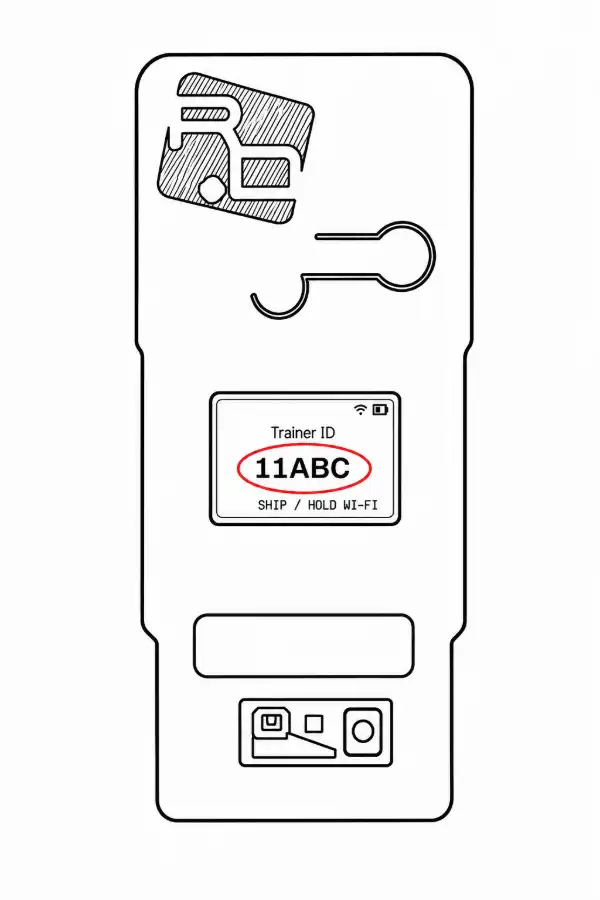

## Quick pairing guide

Pairing links your trainer to your dashboard account. This enables you to track your training history and receive personalized settings. Wi-Fi is optional for pairing but required for syncing features.

Follow the guide below to pair your Trainer:

<Callout type="info" title="To pair your device you must have:">

1. A R+D dashboard account
2. A Deepthroat Trainer that is connected to Wi-Fi

</Callout>

<Steps>
  <Step>

### Log in to your R+D dashboard account

  </Step>
  <Step>

### Select "My Devices"

  </Step>
  <Step>

### Select "Pair a Deepthroat Trainer"

  </Step>
  <Step>

### Turn on your Deepthroat Trainer

  </Step>
  <Step>

### Take note of the Trainer ID that the device screen displays on boot

  </Step>
  <Step>

### Enter your Trainer ID in the "Deepthroat Trainer ID" field

  </Step>
  <Step>

### Select "Pair device"

  </Step>
</Steps>

