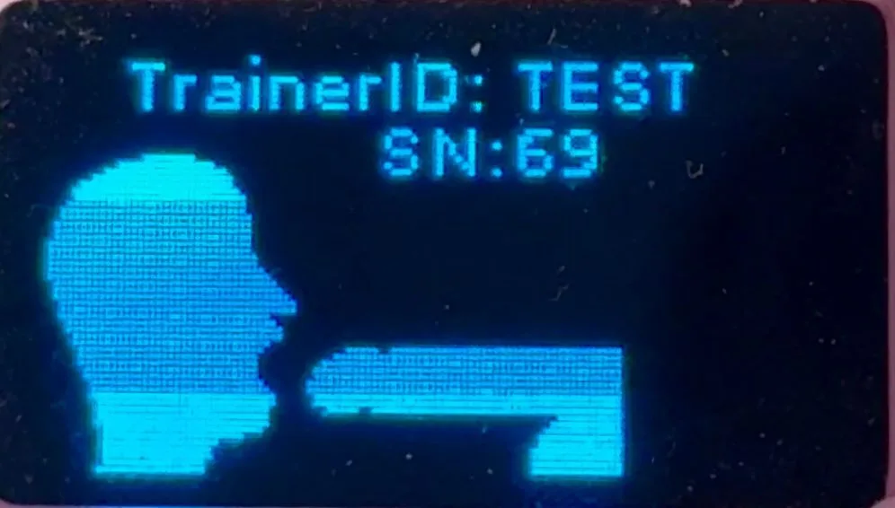

## Avant de commencer

- Chargez le formateur.
- Créez ou connectez-vous à un [dashboard account](https://dashboard.researchanddesire.com/?register=true).
- Gardez l'appareil à proximité afin de pouvoir le redémarrer et lire l'affichage.

## Étapes d'appairage

### 1. Trouvez le Trainer ID

Allumez le Trainer. Lors du démarrage, lisez les 5 à 6 caractères Trainer ID en haut de l'écran. Copiez exactement ses lettres et ses chiffres.

### 2. Ouvrez les paramètres de l'appareil

Ouvrez [dashboard device settings](https://dashboard.researchanddesire.com/app/settings). Si vous êtes déconnecté, le tableau de bord conserve cette destination lors de la connexion.

### 3. Entrez l'identifiant

Choisissez l'action de couplage Deep Throat Trainer, entrez l'ID sans espaces et soumettez-le.

### 4. Vérifiez

<Callout type="success" title="Succès">

Le tableau de bord affiche une confirmation de réussite et le formateur apparaît dans la liste de vos appareils. Le couplage ne configure pas Wi-Fi ; complétez [Wi-Fi setup](/dtt/quick-start/pairing/wifi-setup) ensuite.

</Callout>

## Dépannage

| Problème | Actions |
| ------------------------------------------------ | --------------------------------------------------------------------------------------------------------------------------------------------- |
| L'identifiant a disparu avant que vous ne le copiiez | éteindre, allumer et regarder l'écran de démarrage |
| Pièce d'identité rejetée | case à cocher, lettres par rapport aux chiffres et espaces accidentels |
| l'appareil est déjà couplé | demander au propriétaire actuel de le dissocier dans les paramètres de l'appareil du tableau de bord |
| le compte ou le propriétaire d'origine n'est pas disponible | envoyez un e-mail à [support@researchanddesire.com](https://www.researchanddesire.com/pages/contact-us) avec le Trainer ID et les détails d'achat disponibles |
| le tableau de bord indique couplé mais l'appareil est hors ligne | utilisez [Wi-Fi setup](/dtt/quick-start/pairing/wifi-setup) ; ne plus jumeler |

## Présentation vidéo

<iframe
  src="https://www.loom.com/embed/0693801a3d084bb6b28255debbeeb20e"
  title="Associez un Deep Throat Trainer à son identifiant de formateur"
  frameBorder="0"
  allow="accelerometer; autoplay; clipboard-write; encrypted-media; gyroscope; picture-in-picture"
  allowFullScreen
></iframe>

<Callout type="info" title="Transcription vidéo">

La démonstration allume un Trainer chargé, lit le Trainer ID en haut de l'écran de démarrage, ouvre les paramètres de l'appareil du tableau de bord, saisit cet ID et soumet le formulaire de couplage. Le tableau de bord confirme alors que l'appareil est couplé. Utilisez les étapes écrites ci-dessus pour l’itinéraire actuel du tableau de bord et la récupération du transfert.

</Callout>