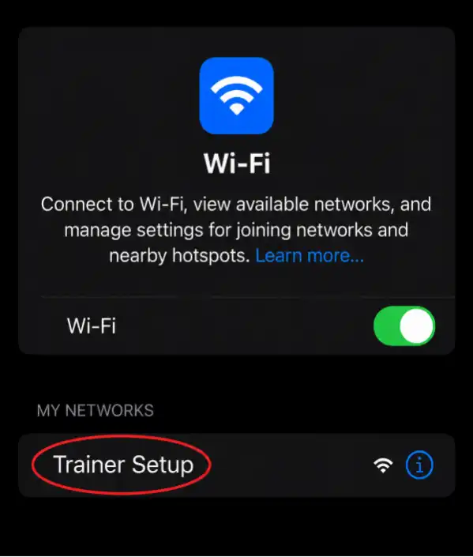

Your Deepthroat Trainer needs a Wi-Fi connection to upload your training results and download new settings. This guide walks you through the setup process.

<Callout type="warn">

**Your trainer only supports 2.4 GHz Wi-Fi networks**. **Make sure you connect to a 2.4 GHz network, not a 5 GHz network**. Many routers broadcast both—look for networks without "5G" in the name.

</Callout>

<Steps>
  <Step>

### Power on your Trainer

  </Step>
  <Step>

### Press and hold the selection button to initiate Wi-Fi setup. This creates a temporary hotspot called "Trainer Setup"

  </Step>
  <Step>

### Navigate to Wi-Fi settings on your phone or computer

  </Step>
  <Step>

### Select the "Trainer Setup" network

  </Step>
  <Step>

### Select "Configure WiFi"

  </Step>
  <Step>

### Select your Wi-Fi network and enter your network name and password, then click "Save"

  </Step>
</Steps>

<Callout type="warn">

Your phone may warn you there's "no internet" on this network—this is expected. When prompted, tap **Stay connected** or **Connect anyway**. Do not disconnect when you see this warning.

</Callout>

<Callout type="info">

This is a local network created by your Trainer — it won't provide internet access. You're connecting directly to the Trainer to configure it.

</Callout>

<Callout type="success">

Your Deepthroat Trainer is now online and ready to sync your training data.

</Callout>

## Troubleshooting

<Callout type="info" title="Troubleshooting: Can't see the setup portal">

If the captive portal doesn't appear automatically after connecting to the Trainer Setup network:

1. **Ignore the "no internet" warning** — Your phone may show warnings like "Connected without internet" or "This network has no internet access." This is expected. Tap **Stay connected** or **Connect anyway**.

2. **Open the portal manually** — Open any web browser and go to `http://192.168.4.1`

3. **Disable mobile data** — If the portal still won't load, turn off mobile data (cellular) on your phone. Some phones prioritize mobile data and won't route traffic through the Trainer Setup network.

4. **Try a different device** — If your phone still won't show the portal, try using a laptop or tablet instead.

<Callout type="warn">

Do not disconnect from the Trainer Setup network when your phone warns about no internet. This warning is normal—the trainer's network is only for configuration, not internet access.

</Callout>

</Callout>
<Callout type="info" title="Troubleshooting: Connection fails after entering password">

- Verify you selected a **2.4 GHz network**, not 5 GHz
- Double-check your password for typos
- Move the trainer closer to your router
- Restart the setup process by holding the button again

</Callout>
