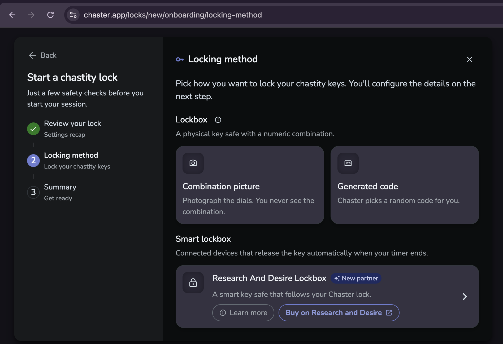
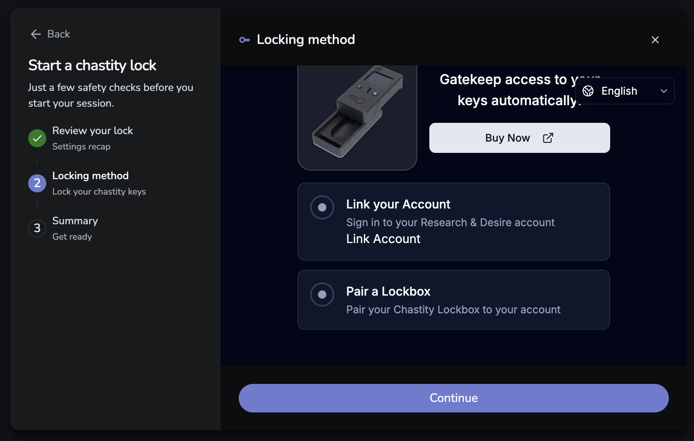
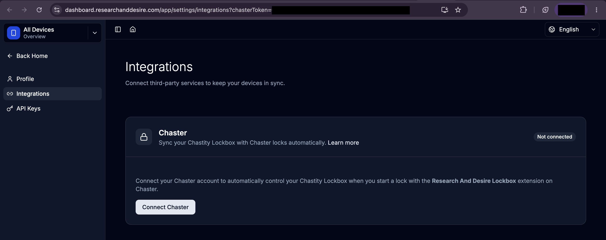
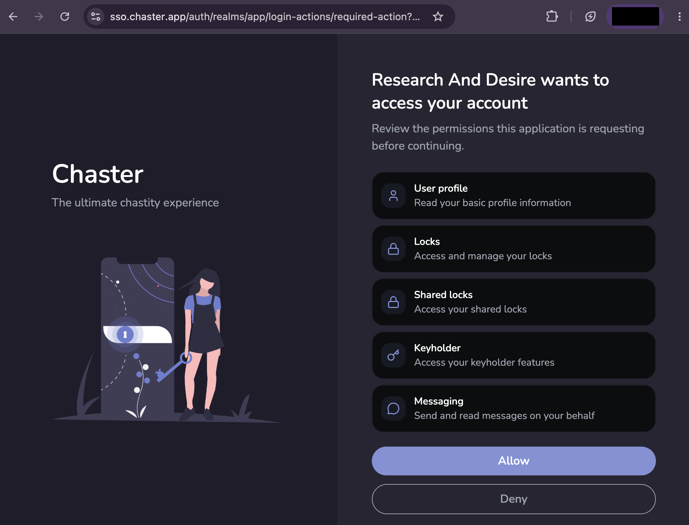
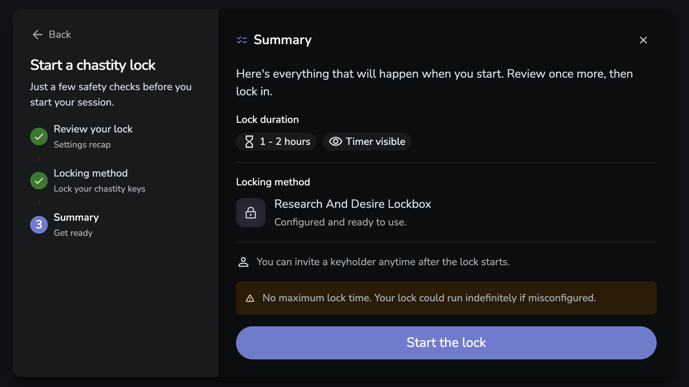
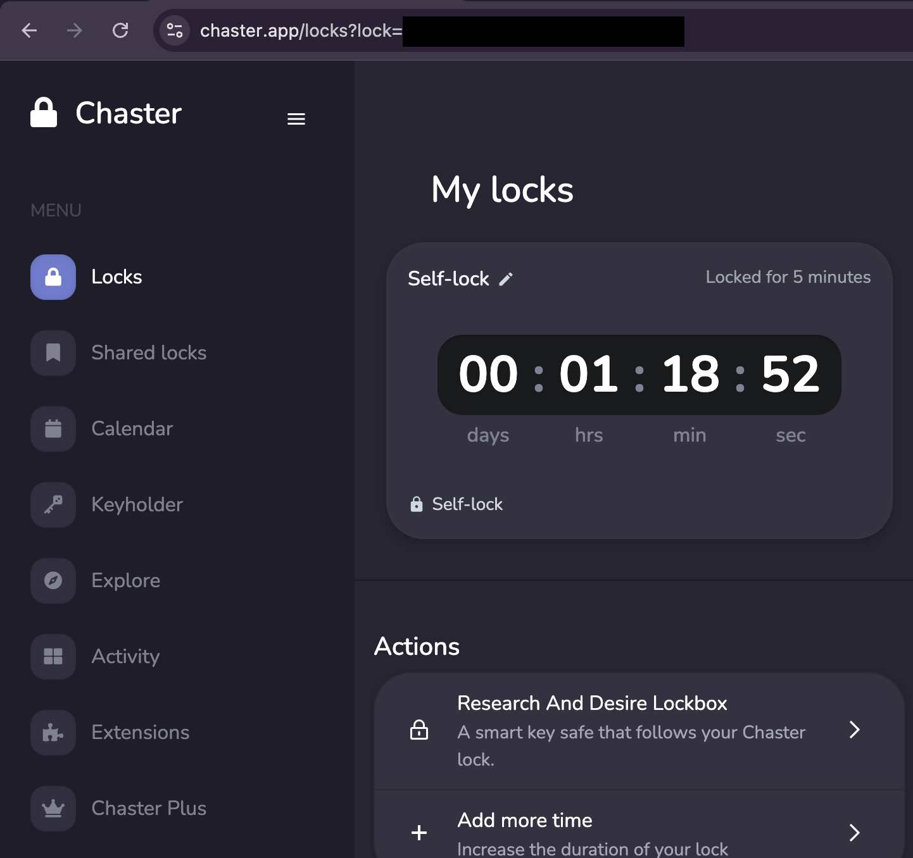

## Before you start

Have these ready:

- A Chaster account and an R+D Dashboard account.
- A Lockbox connected to **2.4 GHz Wi-Fi** and paired to your R+D account. New box? Follow the [Lockbox Quick Start](/lockbox) first.
- An empty Lockbox for your first test.

<Callout type="warning" title="Keep independent emergency access">

Before storing keys, read the [emergency unlock guide](/lockbox/using/emergency-unlock) and [emergency backplate guide](/lockbox/support/emergency-backplate). Confirm that the empty-box test locks and releases successfully.

</Callout>

## 1 Choose the R+D Lockbox in Chaster

Create or join a lock in [Chaster](https://chaster.app/). Under **Locking method → Smart lockbox**, choose **Research And Desire Lockbox**.

Select **Link Account** in the setup panel to sign in to R+D.

## 2 Connect your Chaster account

1. In Dashboard, open **Integrations → Chaster → Connect Chaster**.
2. Sign in to Chaster if asked.
3. Review the permissions for **Research And Desire**, then select **Allow**.
4. Back in Dashboard, check **Connected** and the intended **Linked Account**.

## 3 Confirm account linking and pairing

Return to Chaster. **Link your Account** and **Pair a Lockbox** should both be green. Select **Continue**.

If pairing is incomplete, [pair the Lockbox](/lockbox/quick-start/pairing) to the same R+D account. If the checks have not updated, reload the **Locking method** panel.

## 4 Start the empty-box test

On **Summary**, check the duration, timer visibility, and **Research And Desire Lockbox** locking method.

<Callout type="warning" title="Use a short test with a finite maximum">

Set a short duration and enable **Limit lock time** for the test. **No maximum lock time** can allow a misconfigured lock to run indefinitely. See [Chaster's explanation](https://docs.chaster.app/unlock-your-lock/#limit-lock-time).

</Callout>

1. Close the empty drawer and select **Start the lock**.
2. Allow time for the box to respond. Follow any acceptance or confirmation prompts.
3. Confirm that the intended drawer has physically locked.

**You’re all set!** and a running timer do not confirm physical locking. Chaster has no Lockbox picker; if you own several boxes, check which one received the test.

*This screenshot shows the no-maximum warning. Set a finite maximum for your test.*

## 5 Finish the test

1. When Chaster allows unlocking, use its available unlock controls.
2. Follow any device prompts.
3. Confirm that the drawer opens, the screen says unlocked, and both Chaster and Dashboard show the session has ended.

<Callout type="warning" title="Zero does not confirm release">

A freeze, extension requirement, or minimum duration can still block unlocking. Follow [Chaster's unlock guide](https://docs.chaster.app/unlock-your-lock/) if release is unavailable.

</Callout>

For a later session with keys, put them inside and close the drawer before selecting **Start the lock**.

## Optional session overview

<Mermaid chart={`
flowchart TD
    A["Prepare the paired Lockbox"] --> B["Choose the R+D locking method in Chaster"]
    B --> C["Connect and check both accounts"]
    C --> D["Start an empty-box test"]
    D --> E["Confirm the physical drawer locks"]
    E --> F["Unlock in Chaster and confirm release"]
`} />

To view the linked session, open **My locks → Actions → Research And Desire Lockbox** in Chaster. Select **Open lockbox page** for Dashboard controls. The Chaster card shows status, can lag behind changes, and respects hidden-timer settings.

## Need help

- [Voting with Chaster](/lockbox/chaster/voting): choose a voting link.
- [Chaster FAQ](/lockbox/chaster/faq): account checks, breaks, and Pull.
- [Integration limitations](/lockbox/chaster/limitations): delays and differences between platforms.
