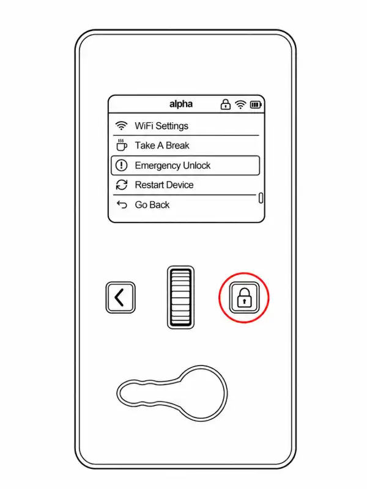
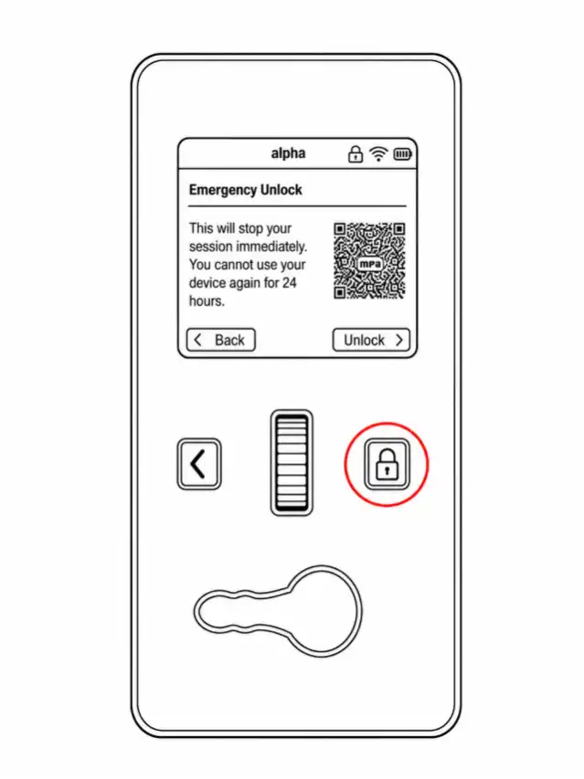

Le déverrouillage d'urgence est une fonction de sécurité locale permettant un accès immédiat lorsqu'un déverrouillage normal ou par porte-clé n'est pas disponible.

<Callout type="warn" title="Utilisez-le quand vous en avez besoin">

Ne retardez pas l'accès d'urgence en raison d'un temps de recharge, d'une notification, d'un score, d'une règle relationnelle ou d'une préoccupation concernant l'explication de la décision. Veillez d’abord à la sécurité.

</Callout>

## Déverrouiller depuis l'appareil

1. Appuyez et maintenez enfoncé le bouton **Enter/Lock** pendant environ deux secondes pour ouvrir le menu de verrouillage.

2. Sélectionnez **Déverrouillage d'urgence**.

3. Confirmez l'action.

4. Confirmez que l'appareil signale qu'il est déverrouillé et que vous pouvez l'ouvrir sans forcer le mécanisme.

## Que se passe-t-il ensuite

La documentation actuelle enregistre ces comportements après le déverrouillage d'urgence du logiciel :

- la session active se termine immédiatement ;
- les partenaires liés peuvent recevoir une notification par e-mail ou sur un tableau de bord ;
- l'action apparaît dans l'activité de l'appareil ; et
- le Lockbox entre dans un temps de recharge de 24 heures avant qu'un autre verrouillage puisse démarrer, à moins que le comportement actuel du tableau de bord ne fournisse une résolution plus précoce.

<Callout type="info">

Le temps de recharge affecte le démarrage d'un autre verrou, et non votre droit de récupérer la clé. Le libellé du tableau de bord et les contrôles de récupération peuvent changer ; suivez l'état indiqué sur votre compte et contactez le support s'il ne s'efface pas comme prévu.

</Callout>

Voir [E-Lock 20](/lockbox/errors/e-lock-20) pour l'état post-déverrouillage.

## Disponibilité

Le déverrouillage d'urgence fonctionne localement sans Internet lorsque l'option est activée. Certains paramètres de session peuvent désactiver l'option logicielle lorsque le Lockbox est déverrouillé. Avant tout verrouillage, vérifiez si l'option sera disponible et examinez le repli matériel.

<Callout type="warn">

La désactivation du déverrouillage d'urgence du logiciel supprime le chemin de version local normal. La solution de rechange restante est un accès matériel destructeur. Ne le désactivez jamais sans l’accord éclairé de toutes les personnes concernées et sans un plan de récupération pratique.

</Callout>

## Si le menu n'est pas disponible

| Situation | Actions |
| ----------------------------------------------- | ---------------------------------------------------------------------------------------------------- |
| L'option de déverrouillage d'urgence est désactivée ou absente | Utilisez [Hardware Backplate Emergency Access](/lockbox/support/emergency-backplate) |
| L'appareil ne répond pas et l'accès n'est pas urgent | Essayez un [restart](/lockbox/device-states/restarting) documenté, puis réévaluez |
| L'appareil signale qu'il ne peut pas être déverrouillé | Suivez [E-Lock 2](/lockbox/errors/e-lock-2), en commençant par le chemin d'urgence |
| L'accès immédiat est toujours impossible | Contactez les services d'urgence locaux et n'utilisez pas d'outils électriques à proximité de la batterie de l'appareil |

## Gardez ceci disponible hors ligne

Enregistrez ou imprimez [Lockbox Safety and Emergency Access](/lockbox/safety) et [Hardware Backplate Emergency Access](/lockbox/support/emergency-backplate) avant un verrouillage long ou géré à distance.