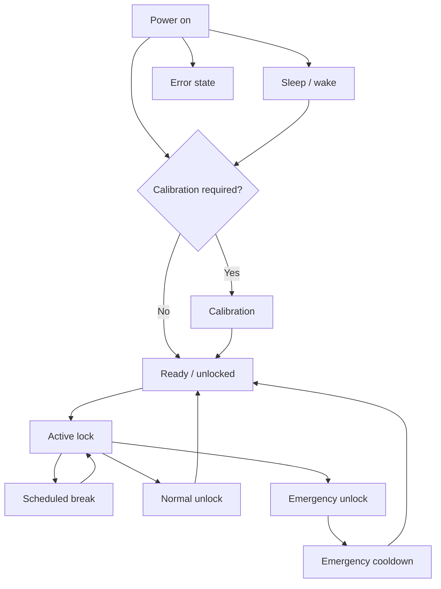

Verwenden Sie den physischen Bildschirm und den Mechanismus zusammen, wenn Sie den Zustand identifizieren. Ein Dashboard-Status kann verzögert sein, während der Lockbox offline ist oder schläft.

## Staatliche Referenz

| Staat | Was Sie sehen sollten | Nächster Leitfaden |
| ------------------- | ---------------------------------------------------- | ------------------------------------------------- |
| Kalibrierung | Tasten- und Motoransagen auf dem Bildschirm | [Calibration](/lockbox/device-states/calibration) |
| Bereit / entsperrt | Entsperrt-Symbol und normales Menü | [Quick Start](/lockbox/quick-start) |
| Aktive Sperre | Gesperrtes Symbol und Informationen zur aktiven Sitzung | [Status Symbols](/lockbox/using/symbols) |
| Geplante Pause | Pausencountdown und temporärer Zugang | [Take a Break](/lockbox/using/take-a-break) |
| Schlaf | Dim/off Anzeige; Konnektivität hängt vom Ruhezustand ab | [Sleep Mode](/lockbox/device-states/sleep-mode) |
| Fehler | E-Lock-Code oder Fehlermeldung | [Error Codes](/lockbox/errors) |
| Notfall-Abklingzeit | E-Lock 20 oder Abklingstatus | [E-Lock 20](/lockbox/errors/e-lock-20) |

Wenn der Gerätestatus nicht bestätigt werden kann, halten Sie den Schlüsselzugriff verfügbar, beenden Sie die Sitzung und verwenden Sie [Support Center](/lockbox/support).