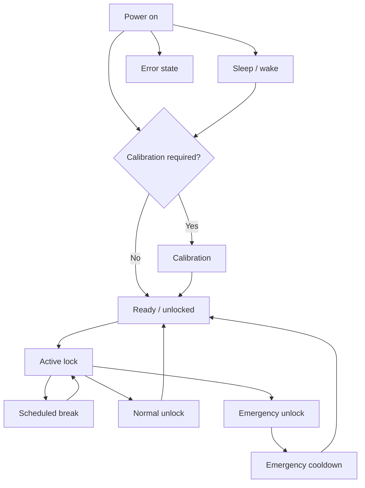

Utilisez l’écran physique et le mécanisme ensemble lors de l’identification de l’état. L'état d'un tableau de bord peut être retardé lorsque le Lockbox est hors ligne ou en veille.

## Référence de l'état

| État | Ce qu'il faut voir | Guide suivant |
| ------------------ | ---------------------------------------------------- | ------------------------------------------------- |
| Calibrage | Bouton à l'écran et invites du moteur | [Calibration](/lockbox/device-states/calibration) |
| Prêt / débloqué | Symbole déverrouillé et menu normal | [Quick Start](/lockbox/quick-start) |
| Verrouillage actif | Symbole verrouillé et informations sur la session active | [Status Symbols](/lockbox/using/symbols) |
| Pause programmée | Compte à rebours et accès temporaire | [Take a Break](/lockbox/using/take-a-break) |
| Dormir | Écran Dim/off ; la connectivité dépend de l'état de veille | [Sleep Mode](/lockbox/device-states/sleep-mode) |
| Erreur | Code E-Lock ou message d'échec | [Error Codes](/lockbox/errors) |
| Temps de recharge d'urgence | E-Lock 20 ou statut de recharge | [E-Lock 20](/lockbox/errors/e-lock-20) |

Si l'état de l'appareil ne peut pas être confirmé, laissez l'accès par clé disponible, arrêtez la session et utilisez le [Support Center](/lockbox/support).