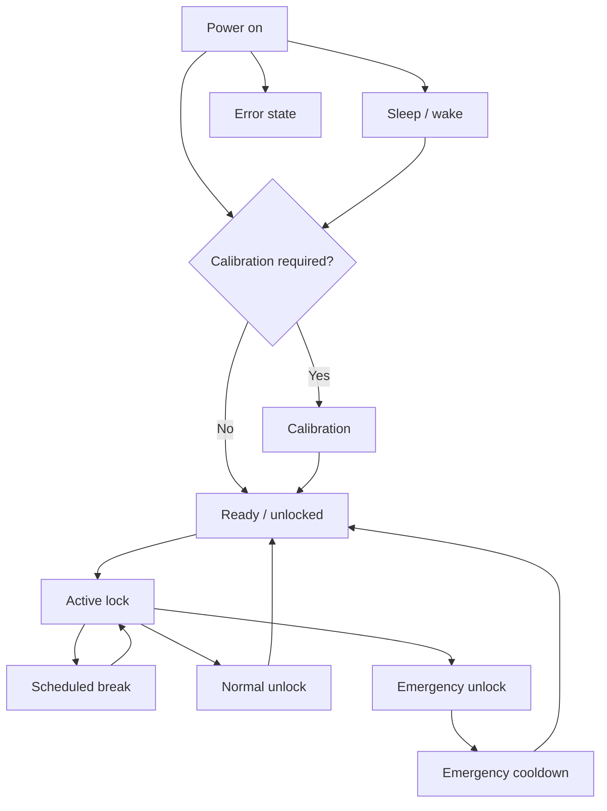

Use the physical screen and mechanism together when identifying state. A dashboard status can lag while the Lockbox is offline or asleep.

## State reference

| State              | What you should see                                  | Next guide                                        |
| ------------------ | ---------------------------------------------------- | ------------------------------------------------- |
| Calibration        | On-screen button and motor prompts                   | [Calibration](/lockbox/device-states/calibration) |
| Ready / unlocked   | Unlocked symbol and normal menu                      | [Quick Start](/lockbox/quick-start)               |
| Active lock        | Locked symbol and active session information         | [Status Symbols](/lockbox/using/symbols)          |
| Scheduled break    | Break countdown and temporary access                 | [Take a Break](/lockbox/using/take-a-break)       |
| Sleep              | Dim/off display; connectivity depends on sleep state | [Sleep Mode](/lockbox/device-states/sleep-mode)   |
| Error              | E-Lock code or failure message                       | [Error Codes](/lockbox/errors)                    |
| Emergency cooldown | E-Lock 20 or cooldown status                         | [E-Lock 20](/lockbox/errors/e-lock-20)            |

If the device state cannot be confirmed, keep key access available, stop the session, and use the [Support Center](/lockbox/support).
