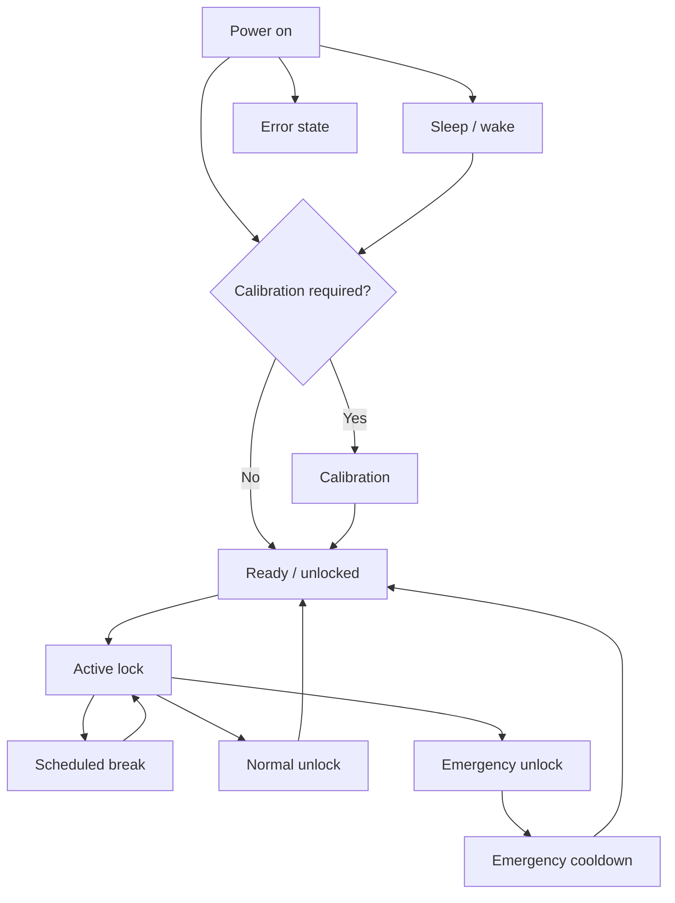

Gebruik het fysieke scherm en het mechanisme samen bij het identificeren van de status. Een dashboardstatus kan achterblijven terwijl de Lockbox offline is of in de slaapstand staat.

## Staatsreferentie

| Staat | Wat je moet zien | Volgende gids |
| ------------------ | ----------------------------------------------- | -------------------------------------------- |
| Kalibratie | Schermknop en motormeldingen | [Calibration](/lockbox/device-states/calibration) |
| Klaar / ontgrendeld | Ontgrendeld symbool en normaal menu | [Quick Start](/lockbox/quick-start) |
| Actief slot | Vergrendeld symbool en actieve sessie-informatie | [Status Symbols](/lockbox/using/symbols) |
| Geplande pauze | Aftellen en tijdelijke toegang onderbreken | [Take a Break](/lockbox/using/take-a-break) |
| Slapen | Dim/off scherm; connectiviteit is afhankelijk van de slaapstatus | [Sleep Mode](/lockbox/device-states/sleep-mode) |
| Fout | E-Lock code of storingsmelding | [Error Codes](/lockbox/errors) |
| Noodafkoeling | E-Lock 20 of cooldown-status | [E-Lock 20](/lockbox/errors/e-lock-20) |

Als de apparaatstatus niet kan worden bevestigd, houd dan de sleuteltoegang beschikbaar, stop de sessie en gebruik de [Support Center](/lockbox/support).