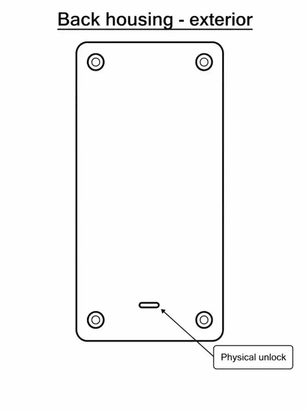
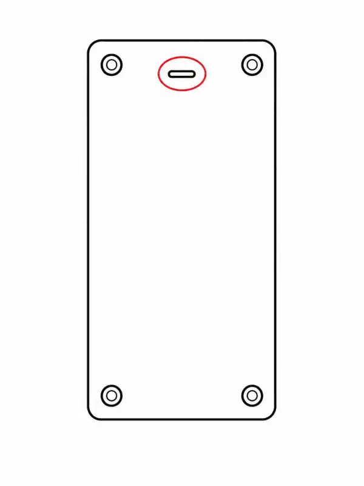

E-Lock 3 prevents locking when the device cannot detect the magnets in the backplate.

<Callout type="info">

The device is not ready to lock while this error is present. Keep the key outside until detection succeeds.

</Callout>

## Correct alignment

1. Remove the backplate completely.
2. Wipe the backplate and attachment area with a dry, lint-free cloth.
3. Inspect for cracks, deformation, loose magnets, or debris.
4. Move strong magnets, speakers, magnetic mounts, and similar objects away.
5. Reattach the backplate in the correct orientation and make sure it sits flush.
6. Confirm the device recognizes the backplate before attempting a short test lock.

## If detection still fails

Restart the Lockbox once using [Restarting Your Device](/lockbox/device-states/restarting). If E-Lock 3 returns or anything is damaged, do not repair or add magnets yourself. Contact [support@researchanddesire.com](https://www.researchanddesire.com/pages/contact-us) with photos of both sides of the backplate and the attachment area.
