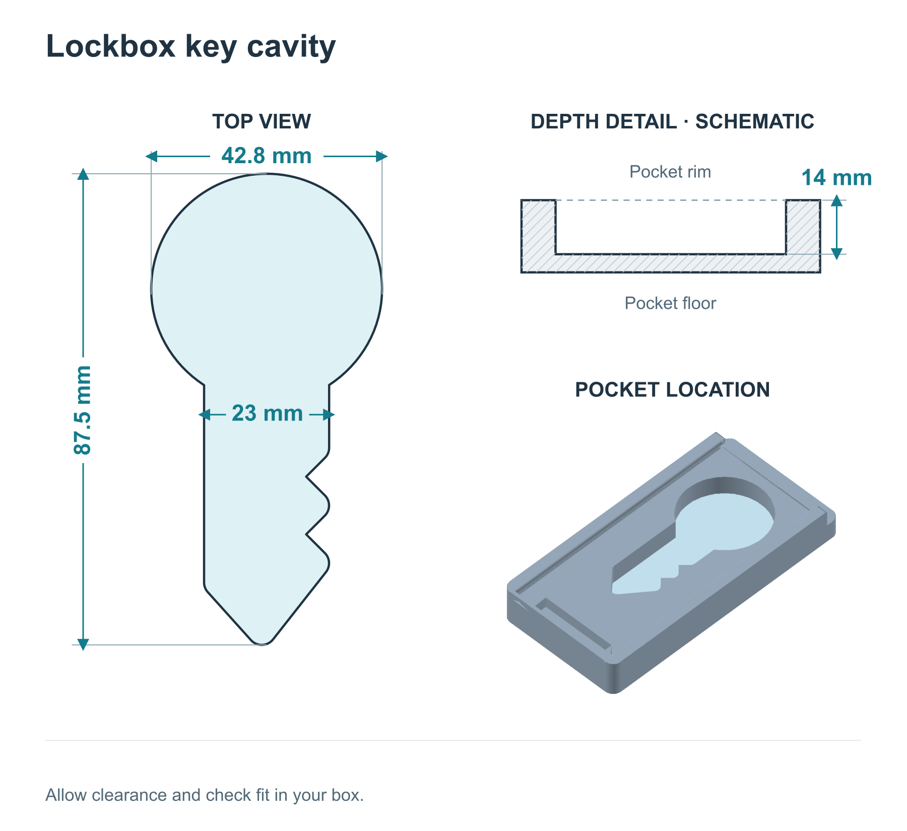

Using Chaster? Follow [Chaster Setup](/lockbox/chaster/setup) for its account linking, first test, and unlock rules. The steps below cover device and Dashboard sessions.

## Before you start

- A USB-C cable that supports data transfer.
- A **2.4 GHz Wi-Fi** network. 5 GHz is not supported.
- A [Dashboard account](https://dashboard.researchanddesire.com) if you want pairing and remote control.

<Callout type="warning" title="Prepare emergency access before storing keys">

Read [Emergency Unlock](/lockbox/device-states/emergency-unlock) and know how to access your keys if the box fails.

</Callout>

## Key cavity dimensions

The dimensions of the key cavity are shown below. If you are interested in a custom Lockbox Bottom, feel free to reach out to our support team for a quote!

## 1 Charge and wake the Lockbox

1. Connect the included USB-C cable and charge for at least **30 minutes** before first use.
2. Press **Enter/Lock** on the right side.
3. Check that the startup screen or main menu appears.

If the device stays off, see [troubleshooting](/lockbox/faqs).

## 2 Connect to Wi-Fi

Automatic Bluetooth pairing in Chrome or Edge can configure Wi-Fi during pairing. For manual setup:

1. Open **Settings → Wi-Fi Settings** on the box.
2. Scan its QR code.
3. Choose your 2.4 GHz network and enter the password.
4. Check for a green dot beside the Wi-Fi icon.

See [Connect to Wi-Fi](/lockbox/quick-start/wifi-setup) for help.

## 3 Pair with Dashboard

1. Sign in to [Dashboard](https://dashboard.researchanddesire.com).
2. Open **Settings → Devices → Pair Lockbox**.
3. Use **Scan for Lockbox** in Chrome or Edge, or enter the box's pairing code.
4. Confirm that the device appears in Dashboard.

See [Pair your Lockbox](/lockbox/quick-start/pairing) for help.

## 4 Start a session

- **On the device:** choose **Lock**, set the duration, and confirm.
- **In Dashboard:** follow [Start a lock from the dashboard](/lockbox/quick-start/start-a-lock) to set duration, breaks, and keyholder rules.

## 5 Unlock and know your emergency options

For device and Dashboard sessions, the box unlocks when the timer expires or the keyholder unlocks it in Dashboard. Keyholders can unlock regardless of the remaining timer.

<Callout type="warning" title="Know how to access your keys">

For urgent access, hold **Enter/Lock** to open the menu, select **Emergency Unlock**, and confirm. This ends the current session; Dashboard consequences depend on its settings.

If the box fails or has no power, use the hardware emergency procedure as a last resort. Use the [hardware emergency procedure](/lockbox/device-states/emergency-unlock).

</Callout>

## Optional introduction video

<iframe src="https://www.loom.com/embed/0f53804a0bc0422081345ec53d7d27a5" title="AJ Introduces the Chastity Lockbox" frameBorder="0" allow="accelerometer; autoplay; clipboard-write; encrypted-media; gyroscope; picture-in-picture" allowFullScreen></iframe>

<Callout type="info" title={"Video transcript"}>

**0:00** Hey there! I'm AJ, and today I'm introducing Research and Desire's Chastity Lockbox. It lets you store any key securely and keep the key with the wearer while a remote keyholder controls access.

**0:15** It's perfect for self-lockers, partners, and pros, and it works from any distance. In this quick start, I'll show you how to connect to Wi-Fi, pair to the dashboard, start a lock, take a break, and use emergency unlock.

**0:30** Once you've got the basics, you're ready to explore and have fun. Let's get started!

</Callout>

## More guides

- [Chaster Setup](/lockbox/chaster/setup): connect Chaster and test an empty box.
- [Voting with Chaster](/lockbox/chaster/voting): choose and share a voting link.
- [Chaster FAQ](/lockbox/chaster/faq): solve account and session problems.
- [Integration limitations](/lockbox/chaster/limitations): check what differs between platforms.
