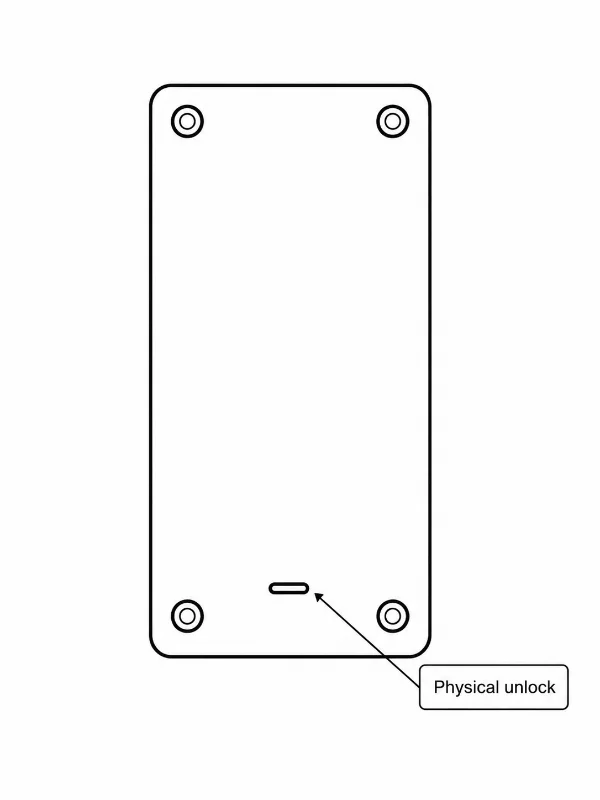

## Controlling your Chastity Lockbox

So you've received your Chastity Lockbox and are wondering how it works. In this guide we'll user certain language to refer to the device's controls and other components. Let's get acquainted with this language:

