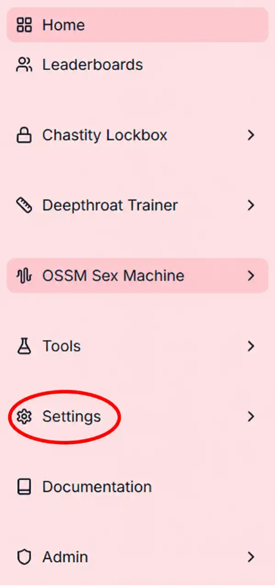

# Using your Chastity Lockbox

## Physical controls

So you've received your Chastity Lockbox and are wondering how it works. In this guide we'll user certain language to refer to the device's controls and other components. Let's get acquainted with this language:

- Left button: back button
- Right button: selection button
- Scroll wheel: moves you between selection options on the device screen
- Screen: allows you to visually interact with the device

<Callout type="warn">

The physical unlock should only be used in emergency situations where a software emergency unlock is unavailable, as its use will irreparably damage the back housing.

</Callout>

<Callout type="success">

Congratulations! You're now an expert on the Chastity Lockbox's physical controls.

</Callout>

## Connecting your Lockbox to WiFi

The Chastity Lockbox is designed to be used in conjunction with the R+D LABS dashboard app. The app gives you access to features such as:

- Partnership & keyholding
- Public voting on locks
- Integration with the Deepthroat Trainer
- Intricate lock settings, including specifics on break times, access to Emergency Unlocks,and more

<Callout type="info">

The Chastity Lockbox is compatible only with 2.4GHz networks.

</Callout>

To connect your device to WiFi, follow the guide below:

<Steps>
  <Step>

### Power

Power on your device by clicking the right button

  </Step>
  <Step>

### Navigate to Settings

  </Step>
  <Step>

### Select WiFi Settings

  </Step>
  <Step>

### Navigate to WiFi settings on your phone or laptop

  </Step>
  <Step>

### Select the Lockbox Setup Network

  </Step>
  <Step>

### Select Configure WiFi

  </Step>
  <Step>

### Select your **local WiFi network**, input your WiFi password, and click save

  </Step>
</Steps>

<Callout type="success">

Your Chastity Lockbox is now connected to WiFi!

</Callout>

Now that your Chastity Lockbox is connected to WiFi, let's pair it with your dashboard account.

## Pairing your Chastity Lockbox

To use your Chastity Lockbox on conjunction with your dashboard account, you need to pair your device. There are two ways to pair your device.

### Pair via Bluetooth

<Callout type="info" title="Bluetooth pairing requirements">

1. Google Chrome or Microsoft Edge browser
2. Desktop or laptop computer
3. Chastity Lockbox is powered ON
4. Chastity Lockbox is not currently paired to an account
5. Chastity Lockbox is connected to WiFi
6. A R+D dashboard account

</Callout>

<Steps>
  <Step>

### Log in

Log in to your R+D dashboard account

  </Step>
  <Step>

### Select Settings from the lefthand tab

  </Step>
  <Step>

### Select My Devices

  </Step>
</Steps>

### Pair via Dashboard