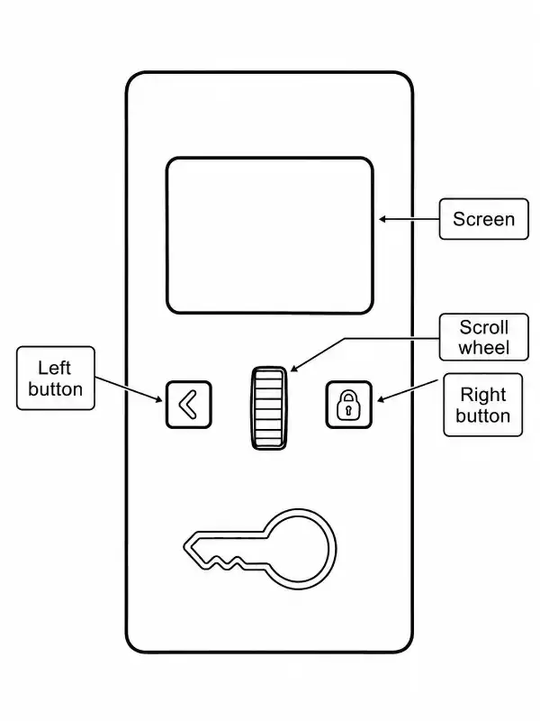
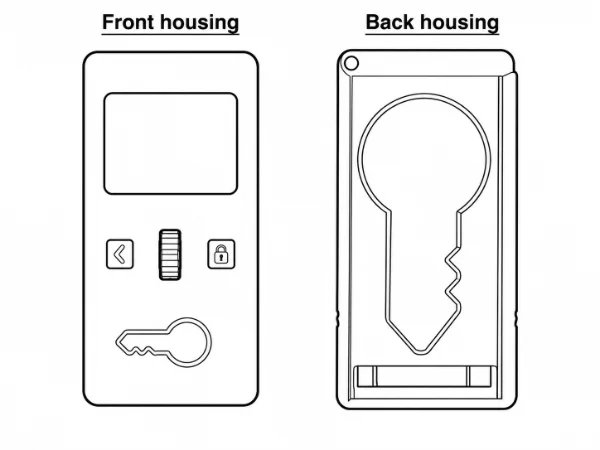
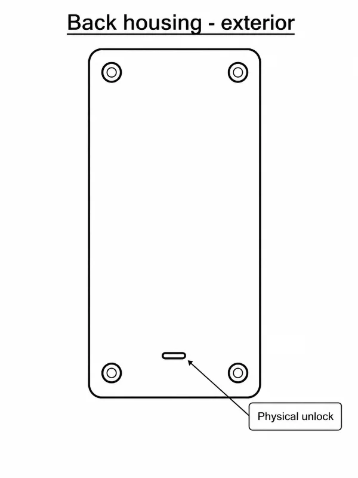

So you've received your Chastity Lockbox and are wondering how it works. In this documentation we'll user certain language to refer to the device's controls and other components. Let's get acquainted with this language:

<Callout type="warn">

**The physical unlock should only be used in emergency situations where a software emergency unlock is unavailable, as its use will irreparably damage the back housing.**

</Callout>

<Callout type="success">

**Congratulations! You're now an expert on the Chastity Lockbox's physical controls.**

</Callout>