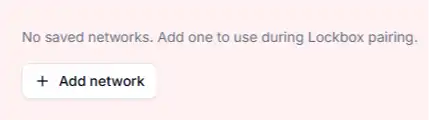
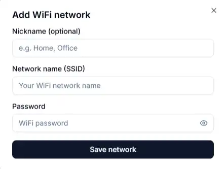
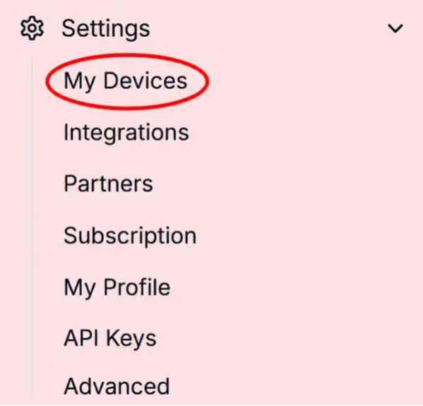
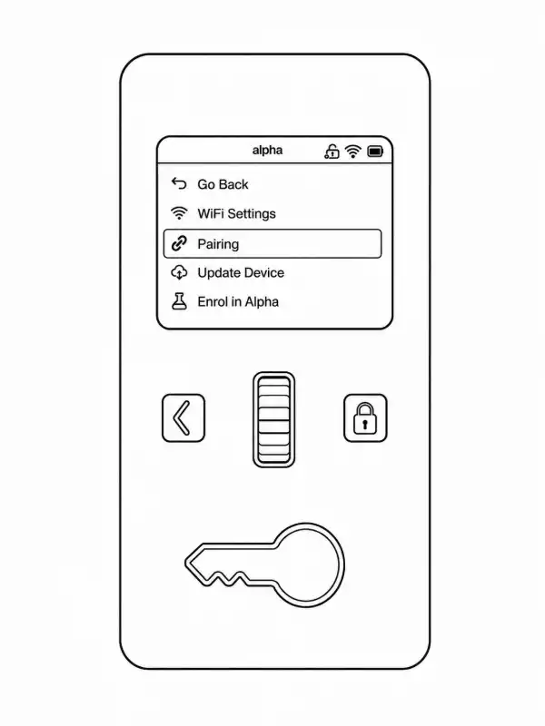
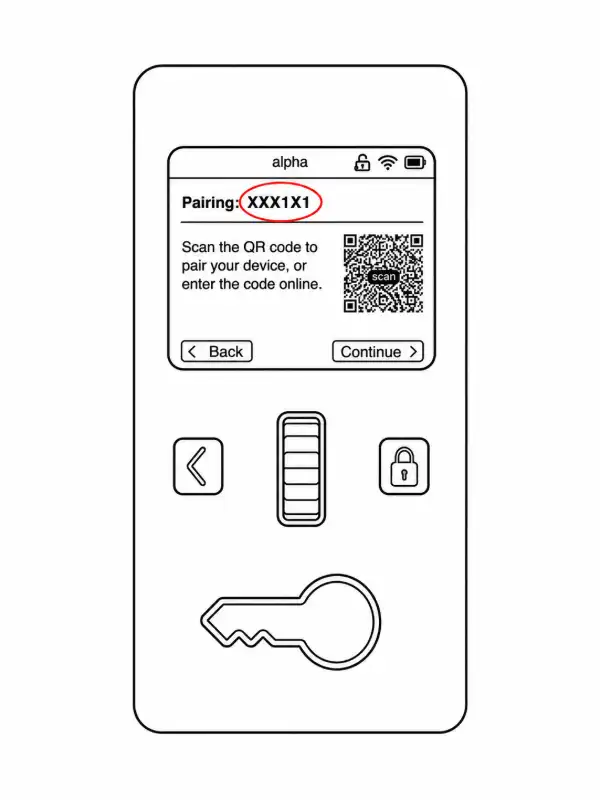
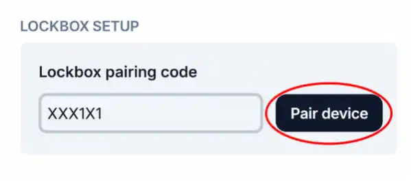

To use your Chastity Lockbox in conjunction with your dashboard account, you need to pair your device. There are two ways to pair your device:

### Pair via Bluetooth

<Callout type="info" title="Bluetooth pairing requirements:">

1. Google Chrome or Microsoft Edge browser
2. Desktop or laptop computer
3. Chastity Lockbox is powered ON
4. Chastity Lockbox is not currently paired to an account
5. Chastity Lockbox is connected to WiFi
6. A R+D dashboard account

</Callout>

<Steps>
  <Step>

### Log in

Log in to your R+D dashboard account

  </Step>
  <Step>

### Select "Settings" from the lefthand tab

  </Step>
  <Step>

### Select "My Devices"

  </Step>
  <Step>

### Select "Add Network"

  </Step>
  <Step>

### Enter local WiFi network info and save network

  </Step>
</Steps>

### Pair Manually

<Callout type="info">

**Manual pairing requirements:**

1. Chastity Lockbox is connected to WiFi
2. Chastity Lockbox is not already paired to another dashboard account

</Callout>

<Steps>
  <Step>

### Log in to your R+D dashboard account

  </Step>
  <Step>

### Select "Settings" from the lefthand tab

  </Step>
  <Step>

### Select "My Devices"

  </Step>
  <Step>

### Select "Pair a Lockbox"

  </Step>
  <Step>

### Power on your Lockbox and select "Settings"

  </Step>
  <Step>

### Select "Pairing"

  </Step>
  <Step>

### Your device's unique pairing code is displayed on screen

  </Step>
  <Step>

### Enter your pairing code and select "Pair device"

  </Step>
</Steps>

<Callout type="success" title="Your device is now paired!">

</Callout>
