### Terminology

There are many ways to initiate a lock session. For clarity, we'll be using some specific chastity-related terminology as we go. Click on a word below for its definition in relation to the Chastity Lockbox:

<Accordions type="single">
  <Accordion title="Self lock">

A lock initiated by you on your device. Self locks can be initiated via device or dashboard. Once initiated, the terms of an active self lock are uneditable.

  </Accordion>
  <Accordion title="Held lock">

A lock initiated by your partner on your device. Held locks can only be initiated via the dashboard. Once initiated, only the keyholder can edit the active lock terms.

  </Accordion>
  <Accordion title="Lockee">

The person subject to the lock.

  </Accordion>
  <Accordion title="Keyholder">

The person who has initiated the lock.

  </Accordion>
  <Accordion title="Active lock">

The lock session you are presently engaged in as lockee and/or keyholder.

  </Accordion>
  <Accordion title="On-device">

Relating to the device's physical controls rather than control via the dashboard.
  </Accordion>
</Accordions>

<Callout type="info" title="If you are in a self lock you are technically both the lockee and the keyholder. However,  self locks and held locks are subject to different conditions, which we will get into later.">

</Callout>

### Starting a Lock On-Device

Before proceeding, ensure that the device is closed (back housing is slotted into the grooves of the front housing).

<Steps>
  <Step>

### Click the right button to awaken your device from sleep

  </Step>
  <Step>

### Select "Lock"

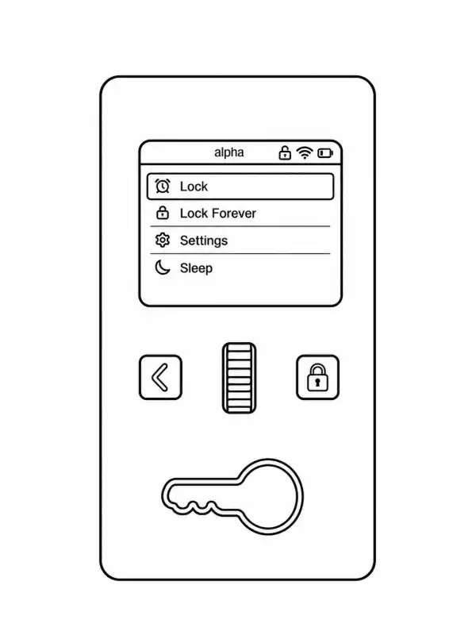

  </Step>
  <Step>

### Use the scroll wheel to set the duration of your lock

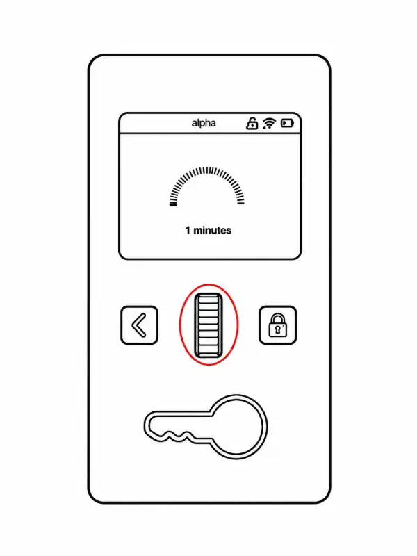

  </Step>
  <Step>

### Click the right button to lock the device

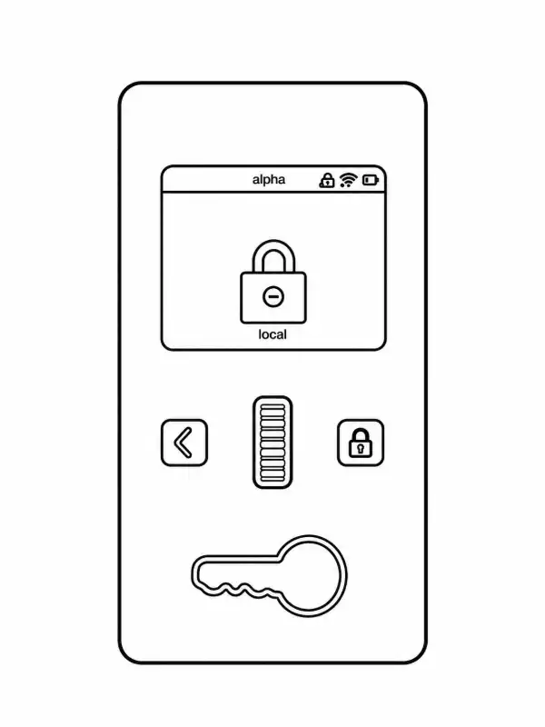

  </Step>
</Steps>

<Callout type="success" title="You are now locked!">

</Callout>

### Creating and Editing Lock Sessions

Lock sessions define the conditions of your lock, including aspects like:

- Duration
- Break times
- Visibility

Lock sessions can be created and edited by you and/or your partner if you have given them access to your devices.

<Callout type="info" title="For self locks:">

You may edit the conditions of your active self lock session while it is active, however these new settings will not apply to the active lock in real time. They will, however, be saved for the future.

</Callout>

<Callout type="info" title="For held locks:">

If a keyholder edits the conditions of an active lock session, the conditions of the active lock will change in real time. Because a keyholder acts through the account of their partner, any new lock session they create will live on the partner's account and not the keyholder's.

</Callout>

#### Creating and Editing Lock Templates on Your Dashboard Account

<Steps>
  <Step>

### Log in to your R+D dashboard account

  </Step>
  <Step>

### Select "Chastity Lockbox"

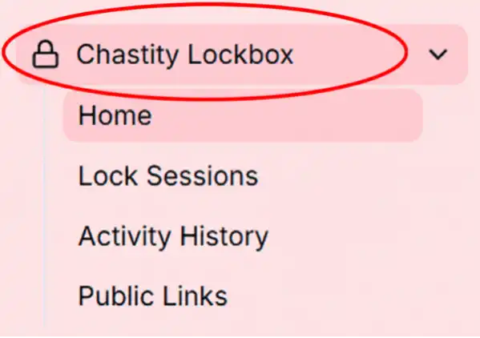

  </Step>
  <Step>

### Select "Lock Sessions"
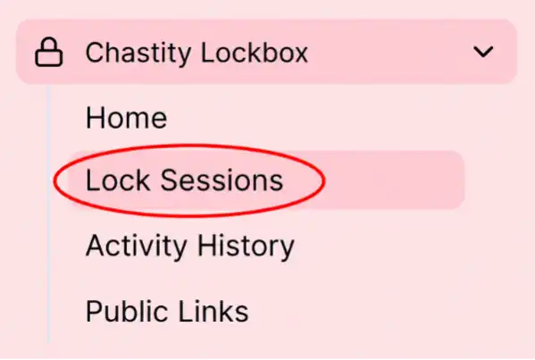

  </Step>
  <Step>

### Select "New lockbox template" to create a new lock session, or "Edit" to edit an existing lock session

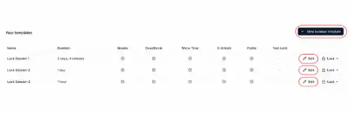

  </Step>
  <Step>

### Choose your desired settings and select "Save"

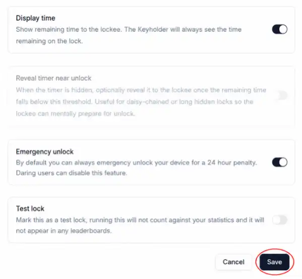

  </Step>
</Steps>

<Callout type="success" title="You have created or edited a new lock!">

</Callout>

#### Creating and Editing Lock Sessions on Your Partner's Account

<Steps>
  <Step>

### Log in to your R+D dashboard account

  </Step>
  <Step>

### Select "Your Account"

  </Step>
  <Step>

### Select your partner's account

  </Step>
  <Step>

### Follow steps 2-5 in the guide above

  </Step>
</Steps>

<Callout type="success" title="You have created or edited a new lock!">

</Callout>

### Starting a Self Lock via the Dashboard

<Callout type="info">

**To start a left lock via the dashboard you'll need:**

1. A computer or phone
2. A R+D dashboard account
3. A Chastity Lockbox that is both paired to your dashboard account and connected to Wifi

</Callout>

<Callout type="warn" title="Once started, self lock settings cannot be edited.">

</Callout>

<Steps>
  <Step>

### Log in to your dashboard account

  </Step>
  <Step>

### Select "Chastity Lockbox"

  </Step>
  <Step>

### Select "Lock Sessions"

  </Step>
  <Step>

### Click the "Lock" button beside the session you want to initiate

  </Step>
  <Step>

### Click "Self Lock"

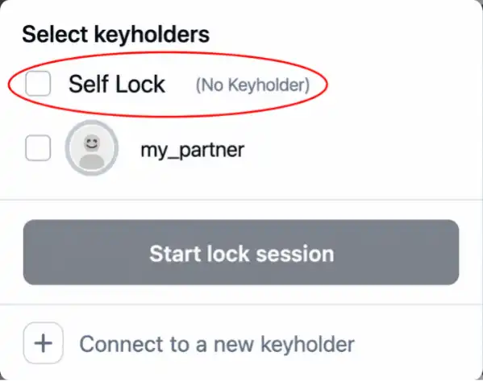

  </Step>
  <Step>

### Click "Start lock session"

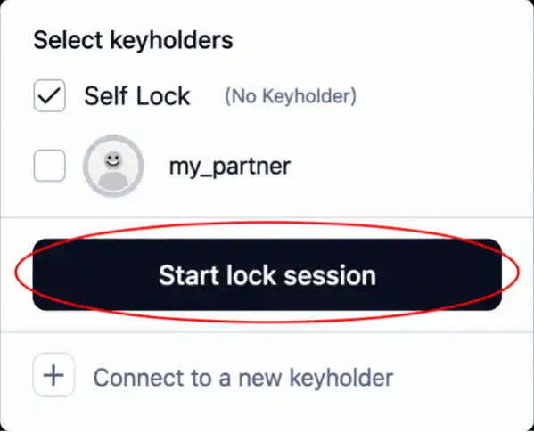

  </Step>
</Steps>

<Callout type="success" title="You are now locked!">

</Callout>

### Starting a Held Lock via the Dashboard

<Callout type="info">

**To start a held lock via the dashboard you'll need:**

1. A R+D dashboard account
2. A partner whose devices you control

**Your partner's Chastity Lockbox must be:**

1. Paired to their R+D dashboard account
2. Connected to WiFi
</Callout>

<Steps>
  <Step>

### Log in to your R+D dashboard account

  </Step>
  <Step>

### Select "Your Account"

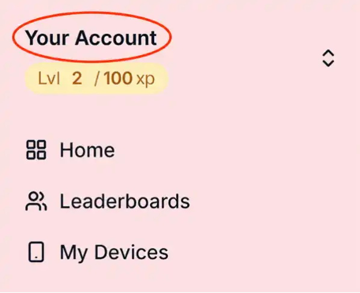

  </Step>
  <Step>

### Select the account of the user you want to lock

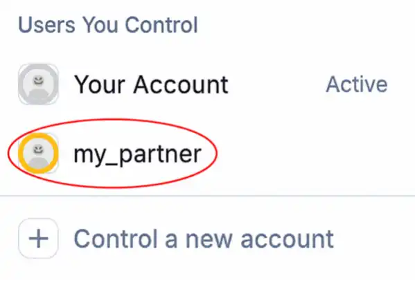

  </Step>
  <Step>

### Select "Chastity Lockbox"

  </Step>
  <Step>

### Select "Lock Sessions"

  </Step>
  <Step>

### Click the "Lock" button beside the session you want to initiate

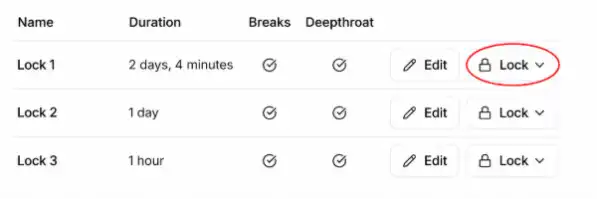

  </Step>
  <Step>

### Click "Start lock session"

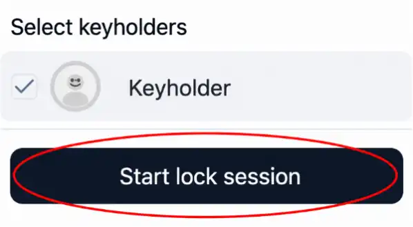

  </Step>
</Steps>

<Callout type="success">

**Your partner is now locked!**

</Callout>