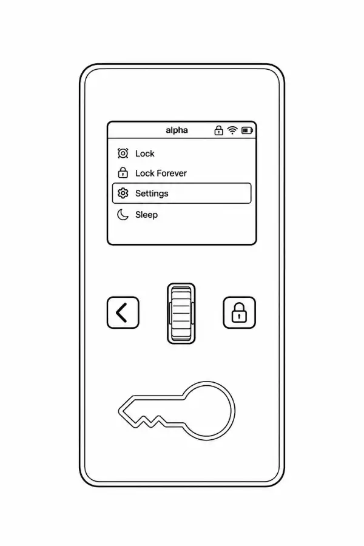
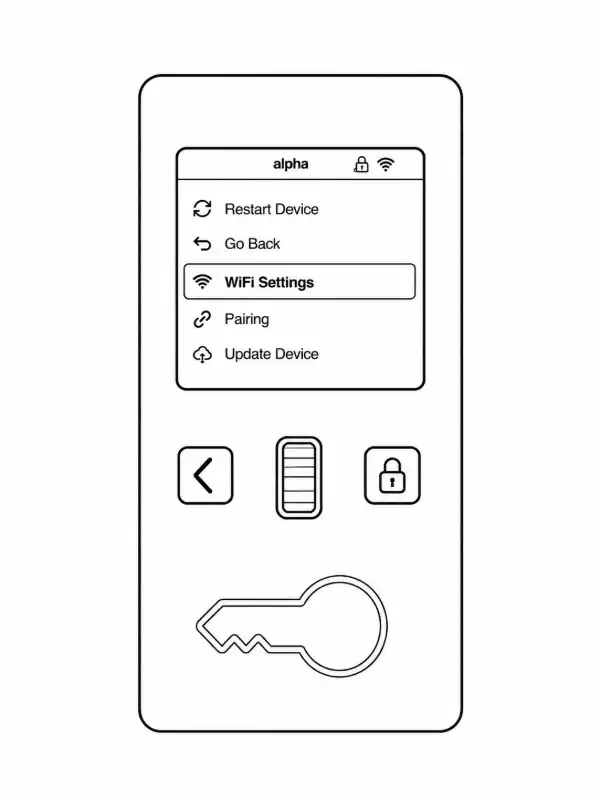
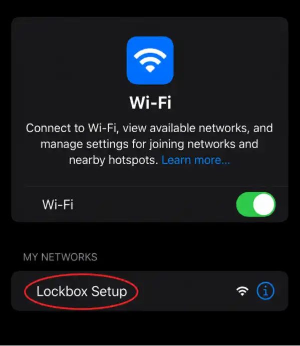
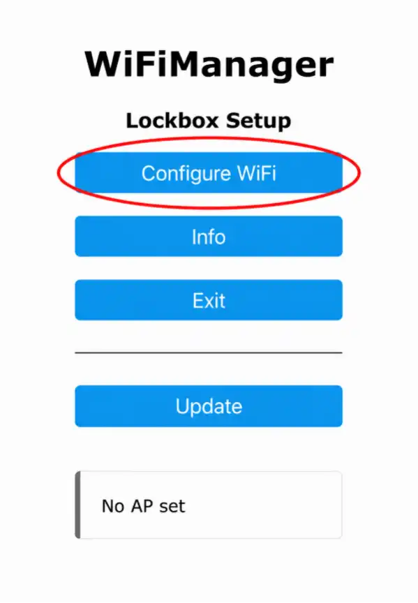
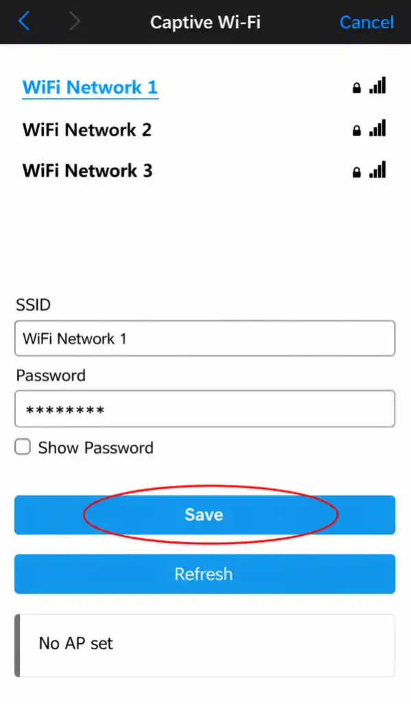

The Chastity Lockbox is designed to be used in conjunction with the R+D LABS dashboard app. The app gives you access to features such as:

- Partnership & keyholding
- Public voting on locks
- Integration with the Deepthroat Trainer
- Intricate lock settings, including specifics on break times, access to Emergency Unlocks, and more

To pair your device to the dashboard, you'll first need to connect it to Wi-Fi.

<Callout type="info">

**The Chastity Lockbox is compatible only with 2.4GHz networks.**

</Callout>

To connect your device to WiFi, follow the guide below:

<Steps>
  <Step>

### Power

Power on your device by clicking the right button

  </Step>
  <Step>

### Select "Settings"

  </Step>
  <Step>

### Select "WiFi Settings"

  </Step>
  <Step>

### Navigate to WiFi settings on your phone or laptop

  </Step>
  <Step>

### Select the Lockbox Setup Network

  </Step>
  <Step>

### Select "Configure WiFi"

  </Step>
  <Step>

### Select your **local WiFi network**, input your WiFi password, and click save

  </Step>
</Steps>

<Callout type="success" title="Your Chastity Lockbox is now connected to Wi-Fi!">

</Callout>

