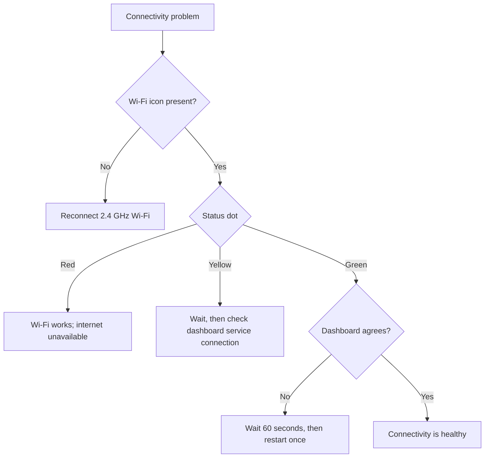

<Callout type="warn">

Bei der Fehlerbehebung bei der Konnektivität handelt es sich nicht um eine Notlösungsmethode. Wenn dringender Schlüsselzugriff erforderlich ist, verwenden Sie [Emergency Access](/lockbox/safety).

</Callout>

## Wählen Sie das sichtbare Symptom

## Kein Wi-Fi-Symbol

1. Wecken Sie den Lockbox; Tiefschlaf schaltet Wi-Fi aus.
2. Bestätigen Sie, dass das gespeicherte Netzwerk 2,4 GHz ist.
3. Führen Sie [Manual Wi-Fi Setup](/lockbox/quick-start/wifi-setup) erneut aus.
4. Wenn E-Lock 10 angezeigt wird, folgen Sie [E-Lock 10](/lockbox/errors/e-lock-10).

## Roter Statuspunkt

Das Gerät ist Wi-Fi beigetreten, kann aber keine Verbindung zum Internet herstellen.

1. Bestätigen Sie, dass ein anderes Gerät im selben Netzwerk auf das Internet zugreifen kann.
2. Vermeiden Sie Netzwerke, die eine Browser-Anmeldung erfordern.
3. Starten Sie den Router neu und warten Sie, bis er wiederhergestellt ist.
4. Testen Sie einen einfachen mobilen Hotspot. Wenn der Hotspot funktioniert, untersuchen Sie den ursprünglichen Router oder die Firewall.

## Gelber Punkt wird nicht grün

Der Lockbox versucht, eine Verbindung über das lokale Wi-Fi-Netzwerk hinaus herzustellen.

1. Warten Sie bis zu 60 Sekunden.
2. Wecken Sie den Lockbox auf und bewahren Sie ihn in der Nähe des Routers auf.
3. Benutzen Sie einmal **Einstellungen → Gerät neu starten**.
4. Wenn die Anzeige in mehr als einem Netzwerk gelb bleibt, wenden Sie sich an den Support.

## Gerät ist grün, aber im Dashboard wird „Offline“ angezeigt

1. Warten Sie bis zu 60 Sekunden, bis der Dashboard-Status aktualisiert wird.
2. Bestätigen Sie, dass Sie bei dem Konto angemeldet sind, dem dieser Lockbox gehört.
3. Aktualisieren Sie das Dashboard einmal.
4. Starten Sie Lockbox mit [Restarting Your Device](/lockbox/device-states/restarting) neu und bestätigen Sie dann den physischen Sperrstatus.
5. Entfernen Sie das Gerät nicht während einer aktiven Sperre, es sei denn, der Support weist Sie dazu an.

## Remote-Befehl ist nicht angekommen

- Bestätigen Sie, dass das Gerät aktiv ist und eine grüne Statusanzeige anzeigt.
– Bestätigen Sie, dass der Befehl an die richtige Lockbox und aktive Sitzung gesendet wurde.
- Warten Sie auf das Dashboard-Statusintervall und versuchen Sie es dann noch einmal.
- Bitten Sie den Lockee, den physischen Gerätestatus zu bestätigen.

<Callout type="warn">

Gehen Sie niemals davon aus, dass die Fernentsperrung allein über das Dashboard erfolgreich war. Der Lockee muss bestätigen, dass der physische Lockbox als entsperrt gemeldet wird und sich normal öffnet.

</Callout>

## Firmware-Kanalunsicherheit

Wenn Sie eine Vorabversion der Firmware verwenden, notieren Sie sich die angezeigte Version und informieren Sie den Support. Dieser Leitfaden erhebt keinen Anspruch darauf, welche Vorabversionen stabil oder kompatibel sind. Installieren Sie die Firmware nur dann neu, wenn der Support Sie dazu auffordert, und verwenden Sie [Flash or Recover Firmware](/lockbox/support/flashing).

## Kontaktieren Sie den Support

Senden Sie eine E-Mail an [support@researchanddesire.com](https://www.researchanddesire.com/pages/contact-us), wenn das Problem in mehreren Netzwerken weiterhin besteht, das Dashboard wiederholt den falschen Status meldet oder eine Sitzung hängen bleibt. Geben Sie die E-Mail-Adresse des Kontos, die angezeigte Firmware-Version, die Anzeigefarbe, das Router-Modell, den aktiven Sperrstatus und bereits ausgeführte Schritte an.