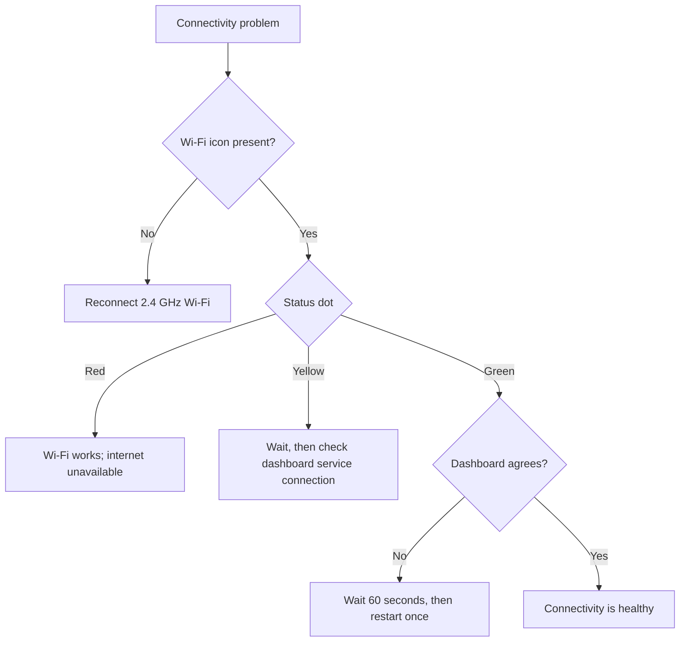

<Callout type="warn">

Le dépannage de connectivité n’est pas une méthode de déverrouillage d’urgence. Si un accès urgent à la clé est nécessaire, utilisez [Emergency Access](/lockbox/safety).

</Callout>

## Choisissez le symptôme visible

## Non Icône Wi-Fi

1. Réveillez le Lockbox ; le sommeil profond désactive Wi-Fi.
2. Confirmez que le réseau enregistré est de 2,4 GHz.
3. Exécutez à nouveau [Manual Wi-Fi Setup](/lockbox/quick-start/wifi-setup).
4. Si E-Lock 10 apparaît, suivez [E-Lock 10](/lockbox/errors/e-lock-10).

## Point d'état rouge

L'appareil a rejoint Wi-Fi mais ne peut pas accéder à Internet.

1. Vérifiez qu'un autre appareil sur le même réseau peut accéder à Internet.
2. Évitez les réseaux qui nécessitent une connexion par navigateur.
3. Redémarrez le routeur, puis attendez qu'il se rétablisse.
4. Testez un simple point d'accès mobile. Si le point d'accès fonctionne, recherchez le routeur ou le pare-feu d'origine.

## Le point jaune ne devient pas vert

Le Lockbox tente de se connecter au-delà du réseau local Wi-Fi.

1. Attendez jusqu'à 60 secondes.
2. Réveillez le Lockbox et gardez-le à proximité du routeur.
3. Utilisez **Paramètres → Redémarrer l'appareil** une fois.
4. Si l'indicateur reste jaune sur plusieurs réseaux, contactez l'assistance.

## L'appareil est vert mais le tableau de bord indique hors ligne

1. Attendez jusqu'à 60 secondes pour que l'état du tableau de bord soit mis à jour.
2. Confirmez que vous êtes connecté au compte propriétaire de ce Lockbox.
3. Actualisez le tableau de bord une fois.
4. Redémarrez le Lockbox à l'aide de [Restarting Your Device](/lockbox/device-states/restarting), puis confirmez l'état du verrouillage physique.
5. Ne retirez pas /re-pair l'appareil pendant un verrouillage actif, à moins que l'assistance ne vous le demande.

## La commande à distance n'est pas arrivée

- Confirmez que l'appareil est réveillé et affiche un indicateur d'état vert.
- Confirmez que la commande a été envoyée au bon Lockbox et à la bonne session active.
- Attendez l'intervalle d'état du tableau de bord, puis réessayez.
- Demandez au Lockee de confirmer l'état physique de l'appareil.

<Callout type="warn">

Ne présumez jamais qu’un déverrouillage à distance a réussi à partir du seul tableau de bord. Le Lockee doit confirmer que les rapports physiques Lockbox sont déverrouillés et s'ouvrent normalement.

</Callout>

## Incertitude du canal Firmware

Si vous utilisez une version préliminaire du micrologiciel, enregistrez la version affichée et informez-en l'assistance. Ce guide ne précise pas quelles versions préliminaires sont stables ou compatibles. Réinstallez le micrologiciel uniquement lorsque le support vous le demande et utilisez [Flash or Recover Firmware](/lockbox/support/flashing).

## Contacter l'assistance

Envoyez un e-mail à [support@researchanddesire.com](mailto:support@researchanddesire.com) si le problème persiste sur plusieurs réseaux, si le tableau de bord signale à plusieurs reprises un état incorrect ou si une session est bloquée. Incluez l'e-mail du compte, la version du micrologiciel affichée, la couleur de l'indicateur, le modèle du routeur, l'état du verrouillage actif et les étapes déjà essayées.