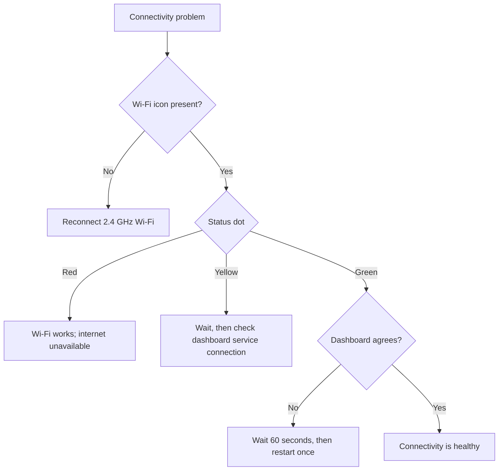

<Callout type="warn">

Connectivity troubleshooting is not an emergency-release method. If urgent key access is needed, use [Emergency Access](/lockbox/safety).

</Callout>

## Choose the visible symptom

## No Wi-Fi icon

1. Wake the Lockbox; deep sleep turns Wi-Fi off.
2. Confirm the saved network is 2.4 GHz.
3. Run [Manual Wi-Fi Setup](/lockbox/quick-start/wifi-setup) again.
4. If E-Lock 10 appears, follow [E-Lock 10](/lockbox/errors/e-lock-10).

## Red status dot

The device joined Wi-Fi but cannot reach the internet.

1. Confirm another device on the same network can reach the internet.
2. Avoid networks that require a browser sign-in.
3. Restart the router, then wait for it to recover.
4. Test a simple mobile hotspot. If the hotspot works, investigate the original router or firewall.

## Yellow dot does not become green

The Lockbox is trying to connect beyond the local Wi-Fi network.

1. Wait up to 60 seconds.
2. Wake the Lockbox and keep it near the router.
3. Use **Settings → Restart Device** once.
4. If the indicator remains yellow on more than one network, contact support.

## Device is green but dashboard says offline

1. Wait up to 60 seconds for the dashboard status to update.
2. Confirm you are signed into the account that owns this Lockbox.
3. Refresh the dashboard once.
4. Restart the Lockbox using [Restarting Your Device](/lockbox/device-states/restarting), then confirm the physical lock state.
5. Do not remove/re-pair the device during an active lock unless support directs you to.

## Remote command did not arrive

- Confirm the device is awake and shows a green status indicator.
- Confirm the command was sent to the correct Lockbox and active session.
- Wait for the dashboard status interval, then try once more.
- Ask the Lockee to confirm the physical device state.

<Callout type="warn">

Never assume a remote unlock succeeded from the dashboard alone. The Lockee must confirm that the physical Lockbox reports unlocked and opens normally.

</Callout>

## Firmware-channel uncertainty

If you are using prerelease firmware, record the displayed version and tell support. This guide does not claim which prerelease versions are stable or compatible. Reinstall firmware only when support instructs you to and use [Flash or Recover Firmware](/lockbox/support/flashing).

## Contact support

Email [support@researchanddesire.com](https://www.researchanddesire.com/pages/contact-us) if the problem remains on multiple networks, the dashboard repeatedly reports the wrong state, or a session is stuck. Include the account email, displayed firmware version, indicator color, router model, active lock state, and steps already tried.
