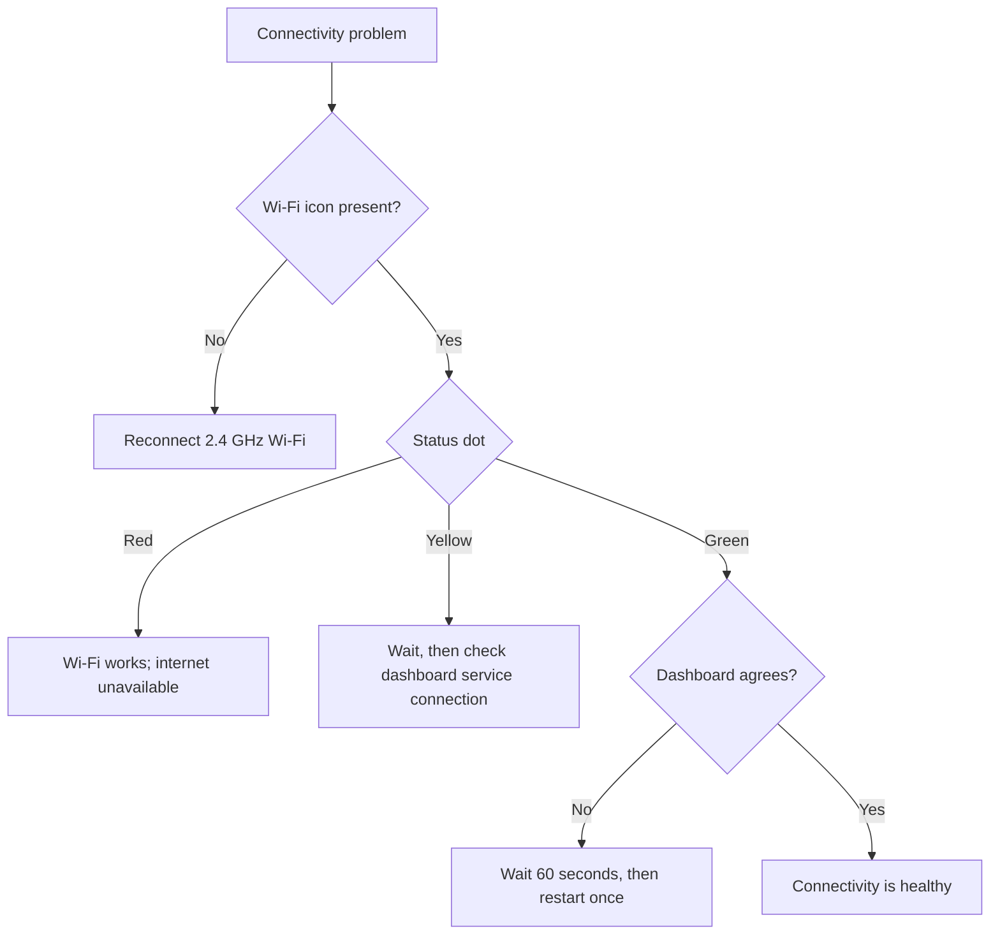

<Callout type="warn">

Problemen met connectiviteit oplossen is geen noodoplossingsmethode. Als er dringend sleuteltoegang nodig is, gebruik dan [Emergency Access](/lockbox/safety).

</Callout>

## Kies het zichtbare symptoom

## Geen Wi-Fi pictogram

1. Activeer de Lockbox; Bij diepe slaap wordt Wi-Fi uitgeschakeld.
2. Controleer of het opgeslagen netwerk 2,4 GHz is.
3. Voer [Manual Wi-Fi Setup](/lockbox/quick-start/wifi-setup) opnieuw uit.
4. Als E-Lock 10 verschijnt, volg dan [E-Lock 10](/lockbox/errors/e-lock-10).

## Rode statusstip

Het apparaat heeft verbinding gemaakt met Wi-Fi, maar kan geen internet bereiken.

1. Bevestig dat een ander apparaat op hetzelfde netwerk internet kan bereiken.
2. Vermijd netwerken waarvoor een browseraanmelding vereist is.
3. Start de router opnieuw op en wacht tot deze is hersteld.
4. Test een eenvoudige mobiele hotspot. Als de hotspot werkt, onderzoek dan de originele router of firewall.

## Gele stip wordt niet groen

De Lockbox probeert verbinding te maken buiten het lokale Wi-Fi netwerk.

1. Wacht maximaal 60 seconden.
2. Maak de Lockbox wakker en bewaar hem in de buurt van de router.
3. Gebruik **Instellingen → Apparaat opnieuw opstarten** één keer.
4. Als de indicator op meer dan één netwerk geel blijft, neem dan contact op met de ondersteuning.

## Apparaat is groen, maar dashboard zegt offline

1. Wacht maximaal 60 seconden totdat de dashboardstatus is bijgewerkt.
2. Bevestig dat u bent aangemeld bij het account dat eigenaar is van deze Lockbox.
3. Vernieuw het dashboard één keer.
4. Start de Lockbox opnieuw op met [Restarting Your Device](/lockbox/device-states/restarting) en bevestig vervolgens de fysieke vergrendelingsstatus.
5. Verwijder/re-pair het apparaat niet tijdens een actieve vergrendeling, tenzij ondersteuning u daartoe opdracht geeft.

## Commando op afstand is niet aangekomen

- Bevestig dat het apparaat wakker is en een groene statusindicator toont.
- Bevestig dat de opdracht naar de juiste Lockbox en actieve sessie is verzonden.
- Wacht op het dashboardstatusinterval en probeer het vervolgens opnieuw.
- Vraag de Lockee om de fysieke apparaatstatus te bevestigen.

<Callout type="warn">

Ga er nooit vanuit dat een ontgrendeling op afstand alleen via het dashboard is gelukt. De Lockee moet bevestigen dat de fysieke Lockbox zich ontgrendeld meldt en normaal opent.

</Callout>

## Firmware-kanaalonzekerheid

Als u prerelease-firmware gebruikt, noteer dan de weergegeven versie en vertel dit aan de ondersteuning. In deze handleiding wordt niet beweerd welke pre-releaseversies stabiel of compatibel zijn. Installeer de firmware alleen opnieuw als de ondersteuning u daartoe opdracht geeft en gebruik [Flash or Recover Firmware](/lockbox/support/flashing).

## Neem contact op met ondersteuning

E-mail [support@researchanddesire.com](https://www.researchanddesire.com/pages/contact-us) als het probleem op meerdere netwerken blijft bestaan, het dashboard herhaaldelijk de verkeerde status meldt of een sessie vastloopt. Vermeld het e-mailadres van het account, de weergegeven firmwareversie, de indicatorkleur, het routermodel, de actieve vergrendelingsstatus en de reeds geprobeerde stappen.