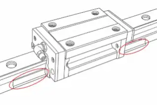

Trennen Sie die Stromversorgung und USB vor der Reinigung, Inspektion, Schmierung oder Änderung des Zubehörs. Ein angehaltener Controller ist kein sicherer Wartungszustand.

## Wartungsplan

| Wann | Prüfen oder Handeln | Nutzungsstoppschwelle |
| ---------------------------------------------- | ----------------------------------------------------------------- | -------------------------------------------------------------------------------- |
| Vor jeder Sitzung | Rahmenstabilität, Befestigungselemente, Gürtel, Schiene, Befestigung, Stromkabel, Controller und Stopp-Aktion | Lose, rissige, ausgefranste, verbogene, verschmutzte, ungewöhnlich laute oder unzuverlässige Teile |
| Nach jeder Sitzung | Entfernen Sie den Aufsatz und wischen Sie Rückstände von zugänglichen Oberflächen ab | Flüssigkeit in einem Gehäuse oder Stecker |
| Monatlich bei regelmäßiger Anwendung | Überprüfen Sie den gesamten Riemenverlauf, die Ausrichtung der Riemenscheiben, den Schienenkanal, die Kabelzugentlastung und das Gehäuse | Riemenzähne oder Kanten beschädigt; Schienenverschlüsse; Riemenscheibe oder Befestigungselement werden von Hand bewegt |
| Wenn die Bewegung rau wird oder Trümmer sichtbar sind | Reinigen Sie die Linearschiene und schmieren Sie sie leicht ein Riefenbildung, Korrosion, anhaltende Bindung oder Rauheit nach der Reinigung |
| Nach einem Transport, einer Kollision oder einer Reparatur | Wiederholen Sie die unbelasteten Referenzfahrt-, Minimalbewegungs- und Stopptests | Jede unerwartete Bewegung oder ein fehlgeschlagener Stopptest |

Dies sind konservative Inspektionsintervalle und kein Ersatz für die Überprüfung vor jedem Gebrauch. Nach starker Beanspruchung oder Einwirkung von Staub, Schmiermitteln oder beim Transport häufiger prüfen.

## Reinigen OSSM

1. Trennen Sie die Stromversorgung und entfernen Sie den Aufsatz.
2. Verwenden Sie ein Mikrofasertuch oder ein ähnlich nicht scheuerndes Tuch, das mit warmem Wasser und einer kleinen Menge milder Spülmittel angefeuchtet ist.
3. Wischen Sie Rückstände von Außenflächen ab, ohne dass Flüssigkeit in den Motor, das Leiterplattengehäuse, die Anschlüsse, den Riemen oder die Schienenlager gelangen kann.
4. Wischen Sie es erneut mit einem sauberen, leicht feuchten Tuch ab und trocknen Sie es vollständig ab, bevor Sie es wieder an die Stromversorgung anschließen.

Tauchen Sie OSSM nicht ein, sprühen Sie keinen Reiniger direkt darauf und verwenden Sie keine Lösungsmittel, Scheuermittel oder Hochdruckluft.

## Schiene reinigen und schmieren

Verwenden Sie das mit der Maschine gelieferte Schmiermittel. Wenn keins verfügbar ist, verwenden Sie nur ein Fett in Lebensmittelqualität, das vom Hersteller ausdrücklich als kompatibel mit Linearlagern und in der Nähe befindlichen Kunststoffen gekennzeichnet ist. Kontaktieren Sie den Support, bevor Sie ein Sprühschmiermittel oder ein Produkt mit unbekannter Materialverträglichkeit austauschen.

<Steps>
  <Step>

### Trennen Sie die Stromversorgung und legen Sie die Schiene frei

Bewegen Sie den Schlitten nur dann von Hand, wenn die Stromversorgung unterbrochen ist. Stoppen Sie, wenn es bindet; erzwinge es nicht.

  </Step>
  <Step>

### Schmutz entfernen

Wischen Sie den zugänglichen Kanal mit einem sauberen Mikrofasertuch ab. Schieben Sie keine Fremdkörper in ein Lager oder Gehäuse.

  </Step>
  <Step>

### Einen dünnen Film auftragen

Geben Sie mit einem sauberen Applikator eine kleine Menge in den inneren Schienenkanal und bewegen Sie dann den Schlitten langsam von Hand, um sie zu verteilen.

  </Step>
  <Step>

### Überschuss entfernen und unbelastet testen

Wischen Sie überschüssiges Material ab, schließen Sie die Stromversorgung bei leerem Verfahrweg wieder an, ermöglichen Sie die Referenzfahrt und testen Sie die minimale Bewegung und den Stopp.

  </Step>
</Steps>

## Reparieren oder ersetzen

Verwenden Sie kein Teil weiter, das gerissen, verbogen, ausgefranst, versengt oder korrodiert ist, nach korrektem Anziehen locker ist, elektrisch beschädigt ist oder sich nicht mehr reibungslos bewegen lässt. Betreiben Sie das Gerät nicht, wenn ein Riemen die Zähne überspringt, eine Befestigung nicht mehr sicher gehalten werden kann, ein Stecker überhitzt ist oder der Stopp unzuverlässig ist. Senden Sie eine E-Mail mit Fotos und dem betroffenen Teil an [support@researchanddesire.com](mailto:support@researchanddesire.com), bevor Sie einen Ersatz bestellen.