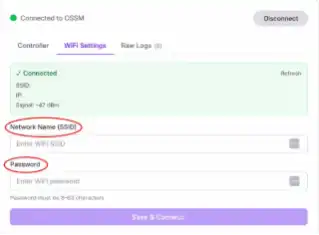
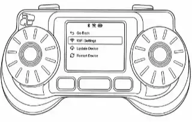
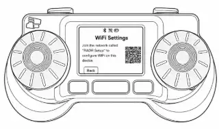
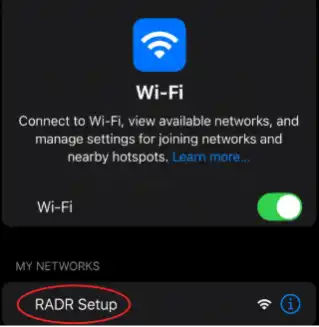
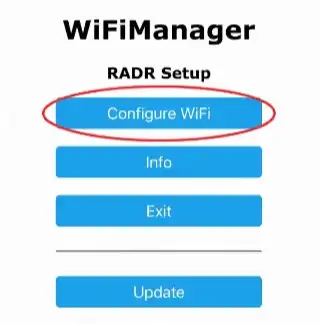
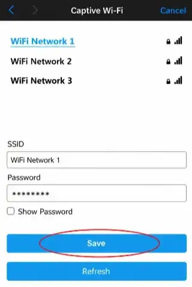

Wi-Fi maakt firmware-updates mogelijk. Dit is niet vereist voor bekabelde lokale bediening. Voor een 2,4 GHz-netwerk hebt u de netwerknaam en het wachtwoord nodig.

## Optie 1: webcontroller

1. Schakel in en start OSSM.
2. Open de [OSSM web controller](/ossm/tools/web-controller) in desktop Chrome of Edge.
3. Selecteer **Verbinden**, kies de OSSM en selecteer **Koppelen**.
4. Open **Wi-Fi Instellingen**, voer de netwerknaam en het wachtwoord in en selecteer vervolgens **Opslaan en verbinden**.

## Optie 2: RADR

1. Sluit RADR aan op OSSM, open **Instellingen** en selecteer **Wi-Fi Instellingen**.
2. Scan de QR code of sluit u aan bij het tijdelijke **RADR Setup**-netwerk dat op het scherm wordt weergegeven.
3. Selecteer in het installatieportaal **Configureer Wi-Fi**.
4. Kies het 2,4 GHz-netwerk, voer het wachtwoord in en sla op.

<Callout type="success" title="Succes">

De Wi-Fi-indicator geeft een groene status weer en blijft ook na een herstart verbonden. Een gele status betekent dat het netwerk is verbonden, maar de online service niet; rood betekent geen Wi-Fi verbinding.

</Callout>

Als de installatie mislukt, controleer dan of 2,4 GHz is ingeschakeld, voer het wachtwoord opnieuw in, ga dichter bij de router staan en zie [OSSM troubleshooting](/ossm/troubleshooting).