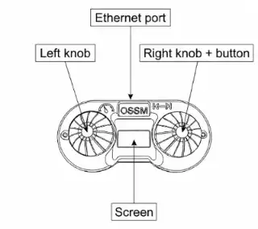
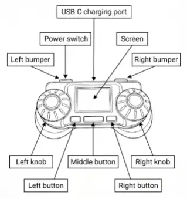
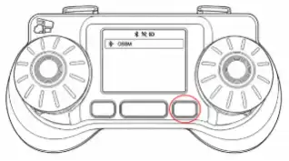
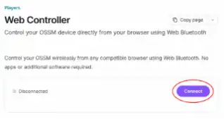
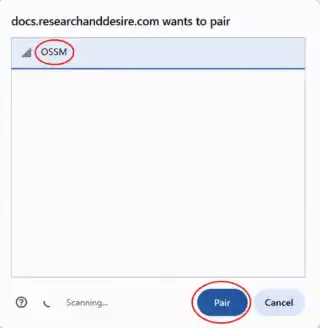

All controllers adjust motion, but their connection and Stop actions differ. Start with speed and depth at zero.

| Controller           | Best when                             | Connection             | Stop action                    |
| -------------------- | ------------------------------------- | ---------------------- | ------------------------------ |
| Wired remote         | You want a direct physical connection | Ethernet cable to OSSM | Press and hold the right knob  |
| RADR wireless remote | You want a dedicated wireless control | Bluetooth              | Press the middle button        |
| Web controller       | You have a supported desktop browser  | Web Bluetooth          | Use the on-screen Stop control |

## Wired remote

1. With OSSM powered off, connect the remote by Ethernet cable.
2. Set both knobs to zero and power on OSSM.
3. Wait for the remote menu.
4. Select a motion mode at minimum settings, then press and hold the right knob to confirm Stop returns to the main menu.

## RADR wireless remote

1. Power on and home OSSM.
2. Turn on RADR and select the detected OSSM with the right button.
3. Confirm the connected device name before changing any motion value.
4. At the minimum setting, press the middle button and confirm motion stops.

## Web controller

Use desktop Chrome or Edge. iOS, Firefox, and Safari do not support the required Web Bluetooth flow.

1. Open the [OSSM web controller](/ossm/tools/web-controller).
2. Select **Connect**, choose your OSSM, and select **Pair**.
3. Keep all motion values at zero.
4. Briefly test minimum motion, then use Stop and confirm motion ceases.

<Callout type="error" title="Do not continue without a reliable Stop control">

If the controller disconnects, selects the wrong device, responds slowly, or fails the Stop test, disconnect OSSM power and resolve the fault before use.

</Callout>
