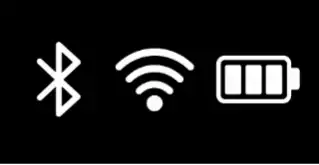
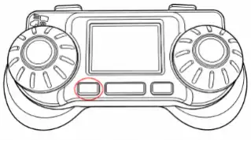

So you've built your OSSM and you're wondering how to put it to good use! Let's dive into this below.

## Connecting Your Device to Power

<Callout type="info">

The OSSM comes with bespoke a 24V 4A DC power supply - this is what will power your machine during play.

</Callout>

Here's how to connect your OSSM to power:

<Steps>
  <Step>

### Plug the socket plug of the power supply cord into a wall socket

  </Step>
  <Step>

### 2. Plug the barrel jack end of the power supply into the barrel jack port on your OSSM board

  </Step>
  <Step>

### 3. Check that the board's LED lights up, and let the device home

  </Step>
</Steps>

<Callout type="success" title="Your OSSM is receiving power!">

</Callout>
<Callout type="info" title="What is 'homing'?">

Homing is the process by which your OSSM gauges the distance between both end points of the linear rail. To home, the device slowly moves the rail back and forth for a short period of time. The OSSM will home when:

1. You connect your OSSM to power
2. You select 'Simple Penetration' or 'Stroke Engine' modes

</Callout>
<Callout type="warn" title="Notice on third party power supply units">

We caution against using third party power supplies as their use may short the OSSM board, thus rendering the OSSM unusable, or provide the machine with insufficient operating power.

</Callout>
## Controlling Your OSSM

You can control your OSSM using one of three different remote types. Click on the relevant remote type below to see a layout of its physical controls:

<Accordions type="single">
  <Accordion title="Wired Remote">

  </Accordion>
  <Accordion title="Wireless Remote (RADR)">

  </Accordion>
  <Accordion title="Web Controller">

  </Accordion>
</Accordions>

### Wired Remote

#### Connecting your Wired Remote to the OSSM

To connect your Wired Remote to the OSSM:

1. Connect the Remote to your OSSM board via Ethernet cable
2. Connect your OSSM to a power source

<Callout type="success" title="The Remote screen will flash the R+D logo and present you with an on-screen menu!">
</Callout>
#### Using the Wired Remote

The Wired Remote has a left and a right knob.

**Right knob**

- Scrolls the menu
- Adjusts stroke length.  You can press and hold the right knob button during play to stop the machine and return to the Remote's main menu
- Acts as a menu selection button
- Acts as a back button outside of Simple Penetration and Stroke Engine modes

<Callout type="info" title="When in Stroke Engine mode double-click the right knob to access pattern selection.">
</Callout>
**Left knob**

- Adjusts stroke speed

### Wireless Remote

#### Connecting your Wireless Remote to the OSSM

The Wireless Remote connects to your OSSM via Bluetooth. To connect your Wireless Remote to your OSSM:

<Steps>
  <Step>

### Power - OSSM

Connect your OSSM to power and let it home.

  </Step>
  <Step>

### Power - RADR

Turn on the Wireless Remote via the power switch.

  </Step>
  <Step>

### Select your OSSM

The Wireless Remote will detect your OSSM. Use the device's right button to select it:

  </Step>
</Steps>

<Callout type="success" title="You can start controlling your OSSM with the Wireless Remote!">

</Callout>
#### Using your Wireless Remote

Use the right knob to adjust depth (stroke length) and the left to adjust speed. You can press the middle button to pause the device instantaneously during play.

The right button acts as a selection button, while the left button acts as a back button.

To explore play patterns, click the rightmost button and select whichever pattern suits your fancy. As with Simple Stroke, you can adjust your Speed, Depth, Sensation, and Stroke settings during play. To alternate between Depth, Sensation, and Stroke selections use the left and right bumpers.

<Callout type="info" title="Sensation affects how each Pattern's unique variable functions.">

</Callout>
#### Status Indicators

The Wireless Remote has a Bluetooth connectivity indicator, a WiFi connectivity indicator, and a battery life indicator. You can find them displayed at the top centre of the device screen.

If there is a green dot beside the WiFi indicator, your device is successfully connected. If there is a yellow dot, your device is connected to WiFi but unable to connect to our server. A red dot indicates no connection to WiFi nor our server.

<Callout type="error" title="If you are unable to connect your Wireless Remote to your OSSM, see our troubleshooting guide here.">
</Callout>
<Callout type="error" title="If you are unable to connect your Wireless Remote to WiFi, see our troubleshooting guide here.">
</Callout>
### Web Controller

The Web Controller allows you to control your OSSM without a physical remote. This remote type requires that your OSSM is connected to WiFi. For instructions on connecting your OSSM to WiFi using the Web Controller, [click this link.](#wifi-setup-option-1)

<Callout type="warn" title="The Web Controller is not supported on iOS devices, nor is it supported on Firefox or Safari browsers.">
</Callout>
### Stroke Engine, Patterns, & Sensation

Patterns provide you with a more exciting, spontaneous way to play with your OSSM. Each pattern has unique, pre-set motion parameters that govern how the OSSM interacts with you during use.

- **Wired Remote** accesses patterns through the "Stroke Engine" selection

- **Wireless Remote** accesses patterns through the "Patterns" selection

- **Web Controller** accesses patterns through the "Pattern" dropdown

Below is a list of the patterns that come with the device and a description of what they do:

<Callout type="info">

The "X" factor of each pattern is determined by your Sensation settings. Sensation settings can be adjusted via the Wireless Remote and the Web Controller, but cannot be adjusted via the Wired Remote.

</Callout>

<Accordions type="single">
  <Accordion title="Simple Stroke">

Moves in and out smoothly according to your speed and depth settings. Sensation has no effect.

  </Accordion>
  <Accordion title="Teasing or Pounding">

The machine either thrusts in very slowly and out quickly, or in very quickly and out slowly, as determined by Sensation.

  </Accordion>
  <Accordion title="Robo Stroke">

Adjusts how quickly the device accelerates. Sensation determines acceleration speed.
4. Half'n'Half - Every second stroke is half your selected depth. Sensation affects whether the in our out movement is the faster movement.

  </Accordion>
  <Accordion title="Half'n'Half">

Every second stroke is half your selected depth. Sensation affects whether the in our out movement is the faster movement.

  </Accordion>
  <Accordion title="Deeper">

Starts with shallow thrusts and gradually increases to full length thrusts. Sensation affects how short or long the device takes to reach max thrust depth.

  </Accordion>
  <Accordion title="Stop'n'Go">

A series of strokes with intermittent pauses. Sensation controls the length of the pause.

  </Accordion>
  <Accordion title="Insist">

Tiny rapid pulses. Sensation affects whether the feeling of stroke thrust comes from the base or tip of the rail.

  </Accordion>
</Accordions>

## Connecting Your Device to WiFi

Connecting your OSSM to WiFi enables it to receive firmware updates as they are released. This ensures your device is always up to date!

<Callout type="warn" title="The OSSM is compatible only with a 2.4GHz network.">
</Callout>

### WiFi Setup Option #1 (Web Controller)

<Steps>
  <Step>

### Power

Connect your OSSM to power and let it home.

  </Step>
  <Step>

### Web Controller

Navigate to the [Web Controller URL](https://docs.researchanddesire.com/ossm/tools/web-controller)

  </Step>
  <Step>

### Click "Connect"

  </Step>
  <Step>

### Select your OSSM and click "Pair"

  </Step>
  <Step>

### Enter WiFi credentials in "WiFi Settings" and click "Save & Connect"

  </Step>
</Steps>

<Callout type="success" title="Yay! Your OSSM is connected to WiFi.">
</Callout>

### WiFi Setup Option #2 (Wireless Remote)

<Steps>
  <Step>

### Power

Connect your OSSM to power and let it home.

  </Step>
  <Step>

### Remote

Connect your Wireless Remote to your OSSM.

  </Step>
  <Step>

### Use the left button to navigate to the menu

  </Step>
  <Step>

### Select "Settings"

  </Step>
  <Step>

### Select "WiFi Settings"

  </Step>
  <Step>

### Use your phone camera to scan the QR code

  </Step>
  <Step>

### Connect to the "RADR Setup" WiFi network

  </Step>
  <Step>

### Select "Configure WiFi"

  </Step>
  <Step>

### Enter your WiFi credentials and click  "Save"

  </Step>
</Steps>

<Callout type="success" title="Yay! Your OSSM is connected to WiFi.">
</Callout>
## Pre-play Safety Checklist

The OSSM is a powerful device and we want to make sure you have the tools to use it safely!

Before you use your OSSM for play, make sure to follow these steps:

<Steps>
  <Step>

### Setup

Erect your OSSM and place it in a position that will be comfortable for you during play.

  </Step>
  <Step>

### Stabilize

Place a filled sandbag over the base of the machine for stability.

  </Step>
  <Step>

### Remote

If using a Wired Remote, connect it to the OSSM via Ethernet cable. Set all motion settings to zero.

  </Step>
  <Step>

### Accessorize

Attach your suction cup or Vac-u-Lock toy.

  </Step>
  <Step>

### Power

Connect your OSSM to a power source.

  </Step>
  <Step>

### Preflight

If using a Wireless Remote or the Web Controller, connect to the OSSM now. Set all motion settings to zero.

  </Step>
  <Step>

### Settle in

Get comfortable and slowly adjust motion settings until you feel confident using the device.

  </Step>
</Steps>

<Callout type="success" title="You have completed the OSSM Pre-play Safety Checklist!">
</Callout>
