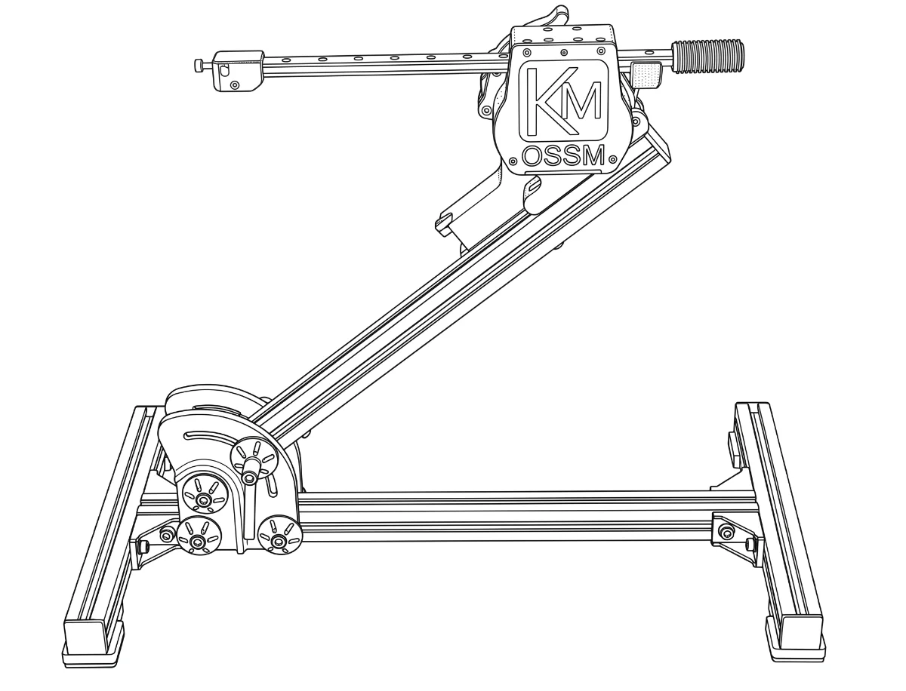

OSSM is de open source-seksmachine. Kies het pad dat overeenkomt met waar u nu bent.

## Kies je pad

<Cards>
  <Card title="Ik heb Ready to Play gekocht" href="/ossm/power-and-homing">
    Sluit de stroom aan, observeer de thuiskomst, kies een controller en voltooi de
    controles bij eerste gebruik.
  </Card>
  <Card
    title="Ik ben een OSSM aan het bouwen"
    href="https://ohai.researchanddesire.com/ossm/build/introduction"
  >
    Open de montageplaats voor onderdelen, gereedschappen, constructie, bedrading en eerst
    testen.
  </Card>
  <Card title="Ik gebruik OSSM al" href="/ossm/how-to-use">
    Ga naar controllers, Wi-Fi, bewegingsbediening, onderhoud of probleemoplossing.
  </Card>
</Cards>

## Vóór elke beweging

Lees [OSSM safety and emergency stop](/ossm/safety), stabiliseer het frame, blijf uit de buurt van de bewegende rail, stel de snelheid en diepte in op nul en test de stopactie van de controller terwijl deze onbelast is.

## Hulp en referentie

<Cards>
  <Card title="Problemen met OSSM oplossen" href="/ossm/troubleshooting">
    Diagnose van de symptomen van voeding, homing, controller, Bluetooth en Wi-Fi.
  </Card>
  <Card title="Verzorging en onderhoud" href="/ossm/care-and-maintenance">
    Reinig, inspecteer, smeer en weet wanneer u moet stoppen en een onderdeel moet vervangen.
  </Card>
  <Card
    title="Hardware en firmware"
    href="https://dev.researchanddesire.com/ossm"
  >
    Vind de ontwikkelaarsreferentie, bronbestanden, licenties en probleemtracker.
  </Card>
</Cards>