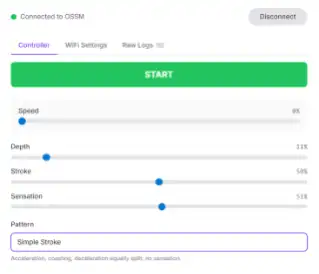

## Before every session

1. Complete the [mandatory safety checklist](/ossm/safety#mandatory-pre-use-checklist).
2. Confirm the intended controller is connected and its Stop action works.
3. Secure the attachment and keep the travel path clear.
4. Set speed and depth to zero before positioning anyone.
5. Begin unloaded, then increase one setting at a time from the lowest practical value.

## Core controls

| Setting   | Effect                                | Safe starting point                                 |
| --------- | ------------------------------------- | --------------------------------------------------- |
| Speed     | How quickly the carriage moves        | Zero, then increase gradually                       |
| Depth     | Stroke travel distance                | Zero, then confirm clearance at a short travel      |
| Pattern   | Motion timing and direction profile   | Simple Stroke before complex patterns               |
| Sensation | Changes the pattern-specific variable | Midpoint only after speed and depth are comfortable |

## Pattern reference

| Pattern             | Behaviour                                        | Sensation effect                        |
| ------------------- | ------------------------------------------------ | --------------------------------------- |
| Simple Stroke       | Smooth, even movement                            | None                                    |
| Teasing or Pounding | Slow one direction, quick the other              | Chooses which direction is faster       |
| Robo Stroke         | Changes acceleration                             | Adjusts acceleration rate               |
| Half'n'Half         | Every second stroke uses half the selected depth | Changes directional emphasis            |
| Deeper              | Gradually increases from shallow to full depth   | Changes how quickly depth increases     |
| Stop'n'Go           | Adds pauses between groups of strokes            | Changes pause duration                  |
| Insist              | Small, rapid pulses                              | Moves the pulse emphasis along the rail |

<Callout type="warn" title="A pattern can change motion abruptly">

Return speed and depth to zero before changing pattern. Retest at low values and stop immediately for unexpected behaviour, loss of connection, pain, numbness, or distress.

</Callout>

After use, stop motion, move clear, disconnect power, remove and clean the attachment, then follow [care and maintenance](/ossm/care-and-maintenance).
