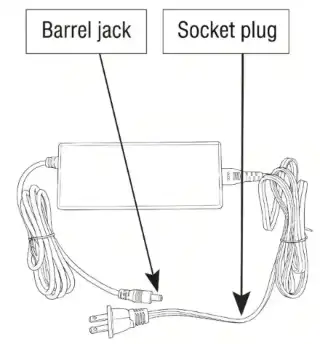
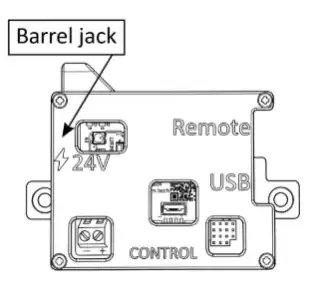
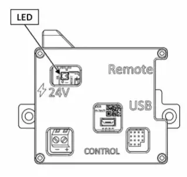

**Resultaat:** OSSM heeft de homing voltooid en wacht met de bewegingsbediening op nul. Wacht ongeveer twee minuten.

## Voordat u de stroom aansluit

- Lees [OSSM safety and emergency stop](/ossm/safety).
- Stabiliseer het frame en maak het volledige spoortraject vrij.
- Stel de snelheid en diepte van de controller in op nul.
- Gebruik de meegeleverde 24 V, 4 A DC-voeding. Vervang geen niet-geverifieerde levering.

<Steps>
  <Step>

### Sluit de voeding aan op de muur

  </Step>
  <Step>

### Sluit de cilinderplug aan op OSSM

Houd handen en voorwerpen buiten het railpad voordat u deze verbinding maakt.

  </Step>
  <Step>

### Observeer de thuiskomst vanaf een veilige afstand

De rail beweegt langzaam om de eindpunten te meten. Houd het niet tegen en raak het niet aan.

  </Step>
</Steps>

<Callout type="success" title="Succes">

Het terugsturen eindigt zonder hindernissen of ongebruikelijke geluiden, de status-LED blijft branden en de wagen staat stil. Ga verder naar [choose and test a controller](/ossm/controllers).

</Callout>

## Als de homing niet eindigt

Koppel de stroom los. Controleer op obstakels, losse riem, beschadigde kabel, onstabiel frame of bevestiging op het rijpad. Schakel een vastgelopen of luidruchtige machine niet herhaaldelijk uit en weer in; gebruik [OSSM troubleshooting](/ossm/troubleshooting) of neem contact op met de ondersteuning.