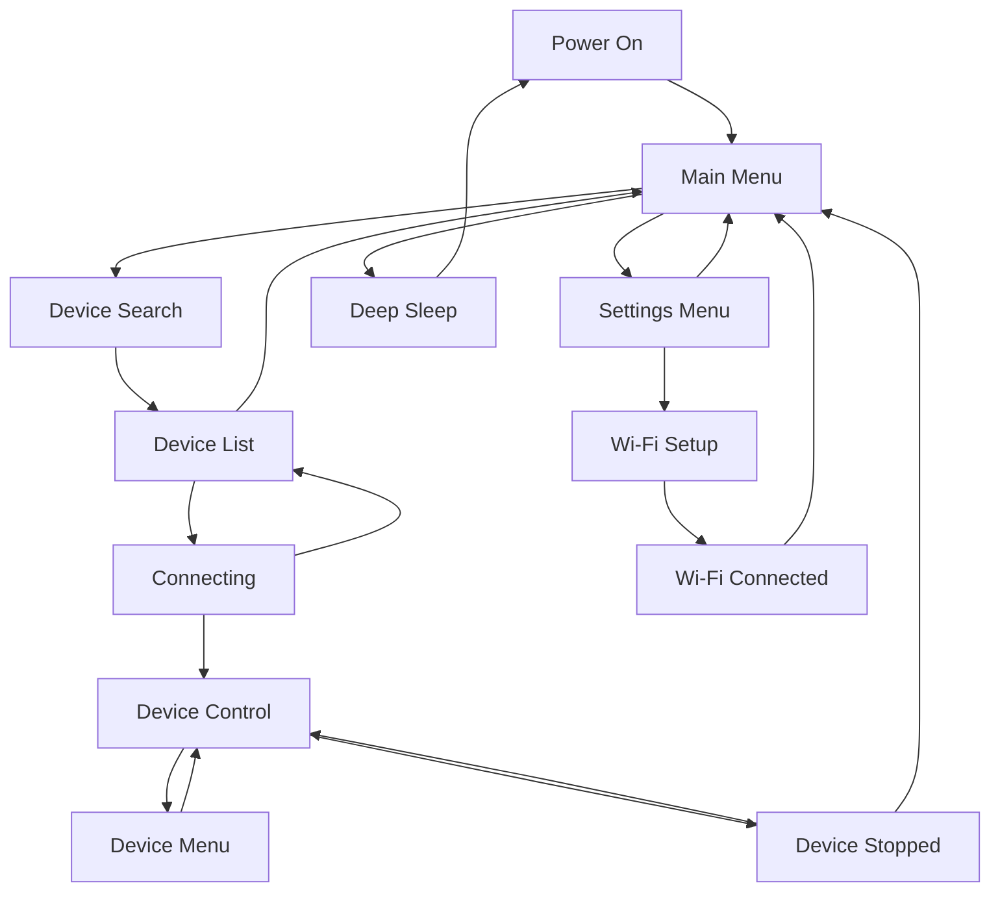

In dieser Anleitung erfahren Sie, wie Sie mithilfe der physischen Bedienelemente durch die Menüs und Bildschirme von RADR navigieren.

.webp>)

## Layout der physischen Steuerung

RADR verfügt über die folgenden physischen Kontrollen:

### Oberkante

- **Linker Bumper** – Befindet sich am oberen linken Rand und wird zum Umschalten in den vorherigen Modus verwendet
- **Netzschalter** – Über dem Bildschirm, links vom USB-C-Anschluss
- **Rechter Bumper** – Befindet sich am oberen rechten Rand und wird zum Wechseln in den nächsten Modus verwendet

### Vorderseite

- **320x240 Vollfarb-LCD** – Zentriert auf dem Gerät
- **Drei Tasten unter dem Bildschirm:**
  - **Linke Taste** – Home / Zurück
  - **Mittlere Taste** – Pause/Stopp (einmaliges Drücken pausiert, zweimaliges Drücken stoppt und setzt zurück)
  - **Rechte Taste** – Menü / OK / Auswählen

### Seiten

- **Linker Encoder (Knopf)** – Steuert immer die Geschwindigkeit oder den primären Parameter
- **Rechter Encoder (Knopf)** – Steuert sekundäre Parameter oder Auswahl

## Hauptmenü

Das Hauptmenü ist Ihr Ausgangspunkt nach dem Einschalten von RADR. Es bietet drei Optionen:

| Option | Symbol | Beschreibung |
| ------------- | ----- | ----------------------------------------- |
| Gerätesuche | Wellen | Nach Bluetooth-Geräten in der Nähe suchen |
| Einstellungen | Ausrüstung | Greifen Sie auf Wi-Fi und Geräteeinstellungen | zu
| Schlaf | Mond | Wechseln Sie in den Tiefschlafmodus, um den Akku zu schonen |

### Navigation

- **Rechter Encoder** – Scrollen Sie durch die Menüoptionen
- **Rechte Taste** – Wählen Sie die hervorgehobene Option aus
- **Linke Taste** – Keine Aktion (bereits auf oberster Ebene)

## Einstellungsmenü

Greifen Sie über das Hauptmenü auf das Einstellungsmenü zu, indem Sie **Einstellungen** auswählen.

| Option | Beschreibung |
| -------------- | -------------------------------------- |
| Zurück | Zurück zum Hauptmenü |
| Wi-Fi Einstellungen | Konfigurieren Sie Wi-Fi für OTA-Updates |
| Gerät aktualisieren | Nach Firmware-Updates suchen und diese installieren |
| Gerät neu starten | Starten Sie den RADR | neu

### Navigation

- **Rechter Encoder** – Scrollen Sie durch die Optionen
- **Rechte Taste** – Wählen Sie die hervorgehobene Option aus
- **Linke Taste** – Zurück zum Hauptmenü

## Bildschirmzustände

RADR verwendet eine Zustandsmaschine, um verschiedene Bildschirme zu verwalten. Hier ist der Ablauf:

### Gerätesuchbildschirm

Wenn Sie im Hauptmenü **Gerätesuche** auswählen:

1. RADR scannt 5 Sekunden lang
2. Blaue LEDs pulsieren während des Scans
3. Der Status zeigt „Suche nach Geräten in der Nähe …“
4. Nach dem Scannen erscheint die Geräteliste

### Gerätelistenbildschirm

Nach dem Scannen sehen Sie eine Liste der erkannten Geräte:

- **Rechter Encoder** – Scrollen Sie durch die Geräteliste
- **Rechte Taste** – Mit dem ausgewählten Gerät verbinden
- **Linke Taste** – Abbrechen und zum Hauptmenü zurückkehren

<Callout type="info">

Geräte werden mit ihrem angekündigten Namen angezeigt. Wenn ein Gerät keinen Namen hat, wird es als „Unbekanntes Gerät“ angezeigt.

</Callout>
### Bildschirm zum Verbinden des Geräts

Während der Verbindung werden Statusmeldungen angezeigt:

1. „Verbindung wird initialisiert…“
2. „Neue Verbindung erstellen…“
3. „Verbinden mit [Geräteadresse]…“
4. „Verbunden! Gerät wird eingerichtet…“
5. „Gerätefunktionen entdecken…“
6. „Gerät bereit!“

<Callout type="warn">

Wenn die Verbindung fehlschlägt, wird die Meldung „Verbindung fehlgeschlagen, bitte versuchen Sie es erneut“ angezeigt. Schalten Sie beide Geräte aus und wieder ein und versuchen Sie es erneut.

</Callout>
### Gerätesteuerungsbildschirm

Sobald die Verbindung hergestellt ist, gelangen Sie zum Gerätesteuerungsbildschirm. Das Layout variiert je nach Gerätetyp:

**Für OSSM:**

- Tab-Oberfläche oben mit den Modi „Tiefe“, „Empfindung“ und „Strich“.
- Linkes Encoder-Einstellrad für Geschwindigkeit
- Rechtes Encoder-Einstellrad für den aktiven Modus
- Untere Tasten: Menü (deaktiviert), Pause, Muster

**Für Lovense:**

- Einzelner Encoder für die Vibrationsintensität
- STOP-Taste in der Mitte

Gerätespezifische Details finden Sie unter [OSSM Controls](/radr/guides/user-guide/ossm-controls) oder [Lovense Controls](/radr/guides/user-guide/lovense-controls).

### Gerätemenübildschirm

Bei Geräten, die Muster unterstützen (wie OSSM), öffnet das Drücken der rechten Taste das Mustermenü:

- **Rechter Encoder** – Scrollen Sie durch Muster
- **Rechte Taste** – Wählen Sie das hervorgehobene Muster aus
- **Linke Taste** – Rückkehr zum Steuerungsbildschirm ohne Änderungen

### Bildschirm „Gerät gestoppt“.

Nach einem Doppelklick auf Stopp erscheint dieser Bestätigungsbildschirm:- **Nachricht:** „Ihr Gerät wurde gestoppt und auf die Standard-Wiedergabeeinstellungen zurückgesetzt; es ist aber immer noch verbunden.“
- **Linke Taste (Zurück)** – Rückkehr zum Steuerungsbildschirm
- **Rechte Taste (Home)** – Zurück zum Hauptmenü

## Tastenverhalten nach Bildschirm

| Bildschirm | Linke Taste | Mittlerer Knopf | Rechter Knopf |
| -------------- | ----------------- | ------------- | -------------- |
| Hauptmenü | — | — | Wählen Sie die Option |
| Einstellungsmenü | Zurück zur Hauptseite | — | Wählen Sie die Option |
| Gerätesuche | Abbrechen | — | — |
| Geräteliste | Abbrechen | — | Verbinden |
| Gerätesteuerung | Menü (falls aktiviert) | Pause/Stop | Muster/Menu |
| Gerätemenü | Zurück zur Kontrolle | Pause | Muster auswählen |
| Wi-Fi Setup | Abbrechen | — | — |

## Encoderverhalten nach Bildschirm

| Bildschirm | Linker Encoder | Rechter Encoder |
| -------------- | -------------- | -------------------- |
| Hauptmenü | — | Scroll-Optionen |
| Einstellungsmenü | — | Scroll-Optionen |
| Geräteliste | — | Scroll-Geräte |
| Gerätesteuerung | Geschwindigkeit (0-100 %) | Aktiver Modus (0-100 %) |
| Gerätemenü | Geschwindigkeit (0-100 %) | Scrollmuster |

## Tipps zur Navigation

<Callout type="idea">

Sie können von den meisten Bildschirmen aus auf das Hauptmenü zugreifen, indem Sie wiederholt die linke Taste drücken, um zurückzukehren.

</Callout>
<Callout type="idea">

Mit den Stoßfängertasten (oberer Rand) können Sie zwischen den Modi „Tiefe“, „Empfindung“ und „Strich“ wechseln, ohne auf den Bildschirm zu schauen. Der aktive Modus wird in der Registerkartenoberfläche angezeigt.

</Callout>
<Callout type="warn">

RADR kann jeweils nur eine Verbindung zu einem Gerät herstellen. Um Geräte zu wechseln, trennen Sie zunächst das aktuelle Gerät, indem Sie zum Hauptmenü zurückkehren.

</Callout>