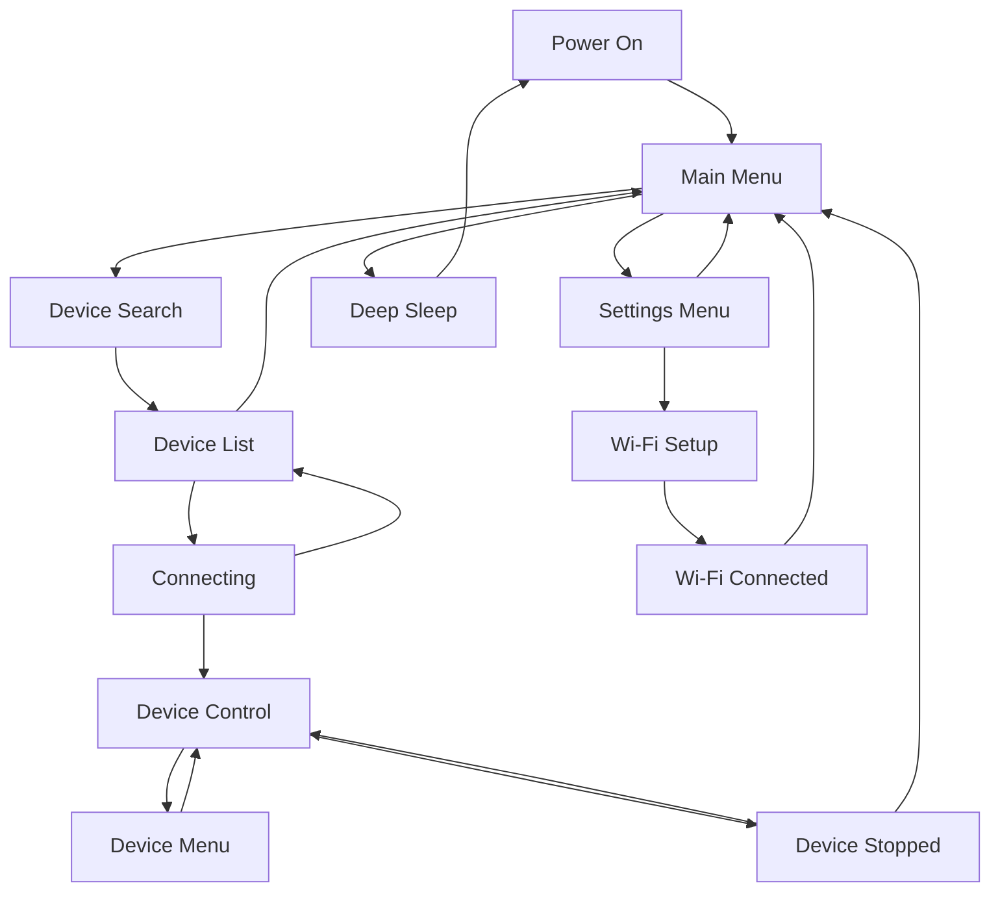

Ce guide explique comment naviguer dans les menus et les écrans de RADR à l'aide des commandes physiques.

.webp>)

## Disposition des contrôles physiques

RADR dispose des contrôles physiques suivants :

### Bord supérieur

- **Pare-chocs gauche** — Situé sur le bord supérieur gauche, utilisé pour passer au mode précédent
- **Interrupteur d'alimentation** — Au-dessus de l'écran, à gauche du port USB-C
- **Pare-chocs droit** — Situé sur le bord supérieur droit, utilisé pour passer au mode suivant

### Face avant

- **LCD couleur 320 x 240** — Centré sur l'appareil
- **Trois boutons sous l'écran :**
  - **Bouton gauche** — Accueil / Retour
  - **Bouton du milieu** — Pause/Arrêt (une simple pression met en pause, une double pression arrête et réinitialise)
  - **Bouton droit** — Menu / OK / Sélectionner

### Côtés

- **Encodeur gauche (bouton)** — Contrôle toujours la vitesse ou le paramètre principal
- **Encodeur droit (bouton)** — Contrôle les paramètres secondaires ou la sélection

## Menu principal

Le menu principal est votre point de départ après la mise sous tension de RADR. Il propose trois options :

| Options | Icône | Descriptif |
| ------------- | ----- | ----------------------------------------- |
| Recherche d'appareil | Vagues | Rechercher les appareils Bluetooth à proximité |
| Paramètres | Équipement | Accéder à Wi-Fi et aux paramètres de l'appareil |
| Dormir | Lune | Passez en mode veille profonde pour économiser la batterie |

### Navigation

- **Encodeur droit** – Faites défiler les options du menu
- **Bouton droit** — Sélectionnez l'option en surbrillance
- **Bouton gauche** — Aucune action (déjà au niveau supérieur)

## Menu Paramètres

Accédez au menu des paramètres à partir du menu principal en sélectionnant **Paramètres**.

| Options | Descriptif |
| ---------- | -------------------------------------- |
| Retourner | Retour au menu principal |
| Wi-Fi Paramètres | Configurer Wi-Fi pour les mises à jour OTA |
| Mettre à jour l'appareil | Rechercher et installer les mises à jour du micrologiciel |
| Redémarrer l'appareil | Redémarrez le RADR |

### Navigation

- **Encodeur droit** – Faites défiler les options
- **Bouton droit** — Sélectionnez l'option en surbrillance
- **Bouton gauche** — Retour au menu principal

## États de l'écran

RADR utilise une machine à états pour gérer différents écrans. Voici le flux :

### Écran de recherche d'appareil

Lorsque vous sélectionnez **Recherche d'appareil** dans le menu principal :

1. RADR scanne pendant 5 secondes
2. Les LED bleues clignotent pendant le scan
3. L'état indique "Recherche d'appareils à proximité..."
4. Après la numérisation, la liste des appareils apparaît

### Écran de liste des appareils

Après l'analyse, vous verrez une liste des appareils découverts :

- **Encodeur droit** — Faites défiler la liste des appareils
- **Bouton droit** — Connectez-vous à l'appareil sélectionné
- **Bouton gauche** — Annuler et revenir au menu principal

<Callout type="info">

Les appareils sont affichés par leur nom annoncé. Si un périphérique n'a pas de nom, il apparaît comme « Périphérique inconnu ».

</Callout>
### Écran de connexion de l'appareil

Pendant la connexion, vous verrez des messages d'état :

1. "Initialisation de la connexion..."
2. "Création d'une nouvelle connexion..."
3. "Connexion à [adresse de l'appareil]..."
4. "Connecté ! Configuration de l'appareil..."
5. "Découverte des capacités de l'appareil..."
6. « Appareil prêt ! »

<Callout type="warn">

Si la connexion échoue, vous verrez « Échec de la connexion, veuillez réessayer ». Redémarrez les deux appareils et réessayez.

</Callout>
### Écran de contrôle des appareils

Une fois connecté, vous entrez dans l’écran de contrôle de l’appareil. La disposition varie selon le type d'appareil :

**Pour OSSM :**

- Interface à onglets en haut affichant les modes Profondeur, Sensation et Course
- Cadran encodeur gauche pour la vitesse
- Cadran encodeur droit pour le mode actif
- Boutons du bas : Menu (désactivé), Pause, Modèles

**Pour Lovense :**

- Cadran encodeur unique pour l'intensité des vibrations
- Bouton STOP au centre

Voir [OSSM Controls](/radr/guides/user-guide/ossm-controls) ou [Lovense Controls](/radr/guides/user-guide/lovense-controls) pour plus de détails spécifiques à l'appareil.

### Écran du menu de l'appareil

Pour les appareils prenant en charge les modèles (comme OSSM), appuyer sur le bouton droit ouvre le menu des modèles :

- **Encodeur droit** — Faites défiler les motifs
- **Bouton droit** — Sélectionnez le motif en surbrillance
- **Bouton gauche** — Revenir à l'écran de contrôle sans modifier

### Écran de périphérique arrêté

Après un double appui sur stop, cet écran de confirmation apparaît :- **Message :** "Votre appareil a été arrêté et réinitialisé aux paramètres de lecture par défaut ; mais il est toujours connecté."
- **Bouton gauche (Retour)** — Retour à l'écran de contrôle
- **Bouton droit (Accueil)** — Retour au menu principal

## Comportement des boutons par écran

| Écran | Bouton gauche | Bouton du milieu | Bouton droit |
| ---------- | ----------------- | ------------- | ---------- |
| Menu principal | — | — | Sélectionnez l'option |
| Menu Paramètres | Retour à la page principale | — | Sélectionnez l'option |
| Recherche d'appareil | Annuler | — | — |
| Liste des appareils | Annuler | — | Se connecter |
| Contrôle des appareils | Menu (si activé) | Pause/Stop | Modèles/Menu |
| Menu de l'appareil | Retour au contrôle | Pause | Sélectionnez le motif |
| Wi-Fi Configuration | Annuler | — | — |

## Comportement de l'encodeur par écran

| Écran | Encodeur gauche | Encodeur droit |
| ---------- | ---------- | -------------------- |
| Menu principal | — | Options de défilement |
| Menu Paramètres | — | Options de défilement |
| Liste des appareils | — | Dispositifs de défilement |
| Contrôle des appareils | Vitesse (0-100%) | Mode actif (0-100%) |
| Menu de l'appareil | Vitesse (0-100%) | Modèles de défilement |

## Conseils pour la navigation

<Callout type="idea">

Vous pouvez accéder au menu principal à partir de la plupart des écrans en appuyant plusieurs fois sur le bouton gauche pour revenir en arrière.

</Callout>
<Callout type="idea">

Les boutons pare-chocs (bord supérieur) basculent entre les modes Profondeur, Sensation et Course sans regarder l'écran. Le mode actif est affiché dans l'interface à onglets.

</Callout>
<Callout type="warn">

RADR ne peut se connecter qu’à un seul appareil à la fois. Pour changer d'appareil, déconnectez d'abord l'appareil actuel en revenant au menu principal.

</Callout>