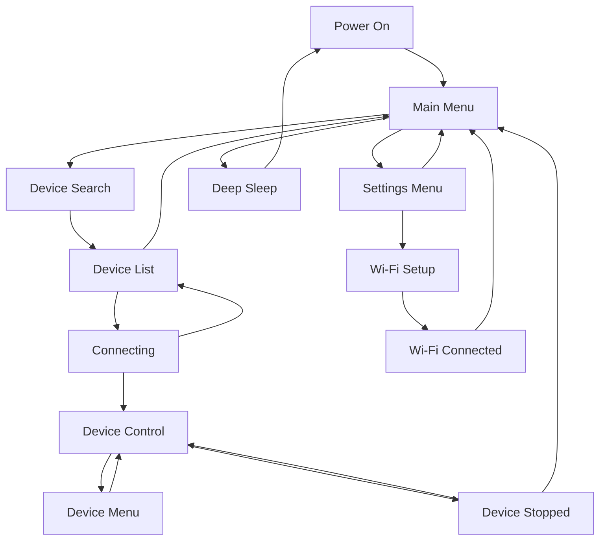

In deze handleiding wordt beschreven hoe u door de menu's en schermen van RADR navigeert met behulp van de fysieke bedieningselementen.

.webp>)

## Fysieke controle-indeling

RADR heeft de volgende fysieke controles:

### Bovenrand

- **Linkerbumper**: bevindt zich in de linkerbovenhoek en wordt gebruikt om naar de vorige modus te schakelen
- **Aan/uit-schakelaar** — Boven het scherm, links van de USB-C-poort
- **Rechterbumper** — Gelegen in de rechterbovenhoek, gebruikt om naar de volgende modus te schakelen

### Voorkant

- **320 x 240 kleuren LCD** — Gecentreerd op het apparaat
- **Drie knoppen onder het scherm:**
  - **Linkerknop** — Home / Terug
  - **Middelste knop** — Pauze/Stop (enkele druk pauzeert, dubbele druk stopt en reset)
  - **Rechterknop** — Menu / OK / Selecteren

### Zijkanten

- **Linker encoder (knop)** — Regelt altijd de snelheid of primaire parameter
- **Rechter Encoder (Knop)** — Regelt secundaire parameters of selectie

## Hoofdmenu

Het hoofdmenu is uw startpunt nadat u RADR hebt ingeschakeld. Het biedt drie opties:

| Optie | Icoon | Beschrijving |
| ------------- | ----- | -------------------------------------- |
| Apparaat zoeken | Golven | Scannen naar Bluetooth apparaten in de buurt |
| Instellingen | Uitrusting | Toegang tot Wi-Fi en apparaatinstellingen |
| Slapen | Maan | Ga naar de diepe slaapmodus om de batterij te sparen |

### Navigatie

- **Rechter Encoder** — Blader door menu-opties
- **Rechterknop** — Selecteer de gemarkeerde optie
- **Linkerknop** — Geen actie (al op het hoogste niveau)

## Instellingenmenu

Open het instellingenmenu vanuit het hoofdmenu door **Instellingen** te selecteren.

| Optie | Beschrijving |
| -------------- | ------------------------------------ |
| Ga terug | Terug naar het hoofdmenu |
| Wi-Fi Instellingen | Configureer Wi-Fi voor OTA-updates |
| Apparaat bijwerken | Firmware-updates controleren en installeren |
| Apparaat opnieuw opstarten | Start de RADR | opnieuw op

### Navigatie

- **Rechter Encoder** — Blader door de opties
- **Rechterknop** — Selecteer de gemarkeerde optie
- **Linkerknop** — Terug naar het hoofdmenu

## Schermstatussen

RADR gebruikt een statusmachine om verschillende schermen te beheren. Hier is de stroom:

### Apparaatzoekscherm

Wanneer u **Apparaat zoeken** selecteert in het hoofdmenu:

1. RADR-scans gedurende 5 seconden
2. Blauwe LED's knipperen tijdens de scan
3. Status toont "Zoeken naar apparaten in de buurt..."
4. Na het scannen verschijnt de apparatenlijst

### Scherm met apparaatlijst

Na het scannen ziet u een lijst met ontdekte apparaten:

- **Rechter Encoder** — Blader door de apparatenlijst
- **Rechterknop** — Maak verbinding met het geselecteerde apparaat
- **Linkerknop** — Annuleren en terugkeren naar het hoofdmenu

<Callout type="info">

Apparaten worden weergegeven met hun geadverteerde naam. Als een apparaat geen naam heeft, wordt het weergegeven als 'Onbekend apparaat'.

</Callout>
### Apparaatverbindingsscherm

Tijdens de verbinding ziet u statusberichten:

1. "Verbinding initialiseren..."
2. "Nieuwe verbinding maken..."
3. "Verbinding maken met [apparaatadres]..."
4. "Verbonden! Apparaat instellen..."
5. "Apparaatmogelijkheden ontdekken..."
6. "Apparaat gereed!"

<Callout type="warn">

Als de verbinding mislukt, ziet u 'Verbinding mislukt, probeer het opnieuw'. Schakel beide apparaten uit en weer in en probeer het opnieuw.

</Callout>
### Apparaatbedieningsscherm

Eenmaal verbonden, komt u in het apparaatbedieningsscherm. De indeling verschilt per apparaattype:

**Voor OSSM:**

- Tabbladinterface bovenaan met de modi Diepte, Sensatie en Beroerte
- Linker encoderknop voor snelheid
- Rechter encoderknop voor de actieve modus
- Onderste knoppen: Menu (uitgeschakeld), Pauze, Patronen

**Voor Lovense:**

- Enkele encoderknop voor trillingsintensiteit
- STOP-knop in het midden

Zie [OSSM Controls](/radr/guides/user-guide/ossm-controls) of [Lovense Controls](/radr/guides/user-guide/lovense-controls) voor apparaatspecifieke details.

### Apparaatmenuscherm

Voor apparaten die patronen ondersteunen (zoals OSSM), wordt door op de rechterknop te drukken het patroonmenu geopend:

- **Rechter Encoder** — Blader door patronen
- **Rechterknop** — Selecteer het gemarkeerde patroon
- **Linkerknop** — Keer terug naar het bedieningsscherm zonder te wijzigen

### Scherm Apparaat gestopt

Na tweemaal op Stop te hebben gedrukt, verschijnt dit bevestigingsscherm:- **Bericht:** "Je apparaat is gestopt en teruggezet naar de standaard afspeelinstellingen; maar het is nog steeds verbonden."
- **Linkerknop (terug)** — Terug naar het bedieningsscherm
- **Rechterknop (Home)** — Terug naar het hoofdmenu

## Knopgedrag per scherm

| Scherm | Linkerknop | Middelste knop | Rechterknop |
| -------------- | ----------------- | ------------- | -------------- |
| Hoofdmenu | — | — | Selecteer optie |
| Instellingenmenu | Terug naar hoofdmenu | — | Selecteer optie |
| Apparaat zoeken | Annuleren | — | — |
| Apparaatlijst | Annuleren | — | Verbinden |
| Apparaatcontrole | Menu (indien ingeschakeld) | Pauze/Stop | Patronen/Menu |
| Apparaatmenu | Terug naar controle | Pauze | Selecteer patroon |
| Wi-Fi Installatie | Annuleren | — | — |

## Encodergedrag per scherm

| Scherm | Linker encoder | Rechter encoder |
| -------------- | -------------- | ------------------- |
| Hoofdmenu | — | Scrollopties |
| Instellingenmenu | — | Scrollopties |
| Apparaatlijst | — | Apparaten scrollen |
| Apparaatcontrole | Snelheid (0-100%) | Actieve modus (0-100%) |
| Apparaatmenu | Snelheid (0-100%) | Scrollpatronen |

## Tips voor navigatie

<Callout type="idea">

U kunt vanuit de meeste schermen toegang krijgen tot het hoofdmenu door herhaaldelijk op de linkerknop te drukken om terug te gaan.

</Callout>
<Callout type="idea">

De bumperknoppen (bovenrand) schakelen tussen de modi Diepte, Sensatie en Beroerte zonder naar het scherm te kijken. De actieve modus wordt weergegeven in de tabbladinterface.

</Callout>
<Callout type="warn">

RADR kan slechts met één apparaat tegelijk verbinding maken. Om van apparaat te wisselen, koppelt u eerst het huidige apparaat los door terug te keren naar het hoofdmenu.

</Callout>