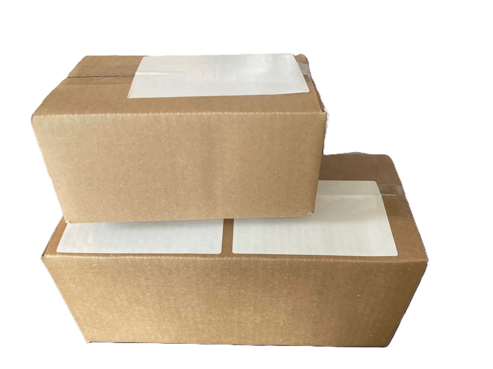
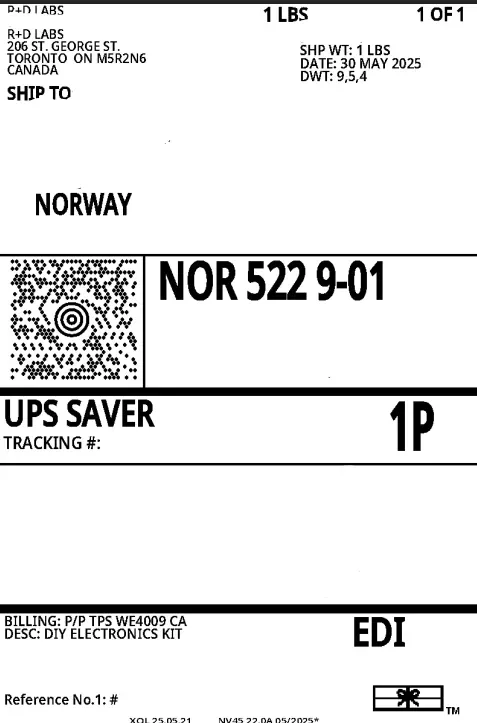
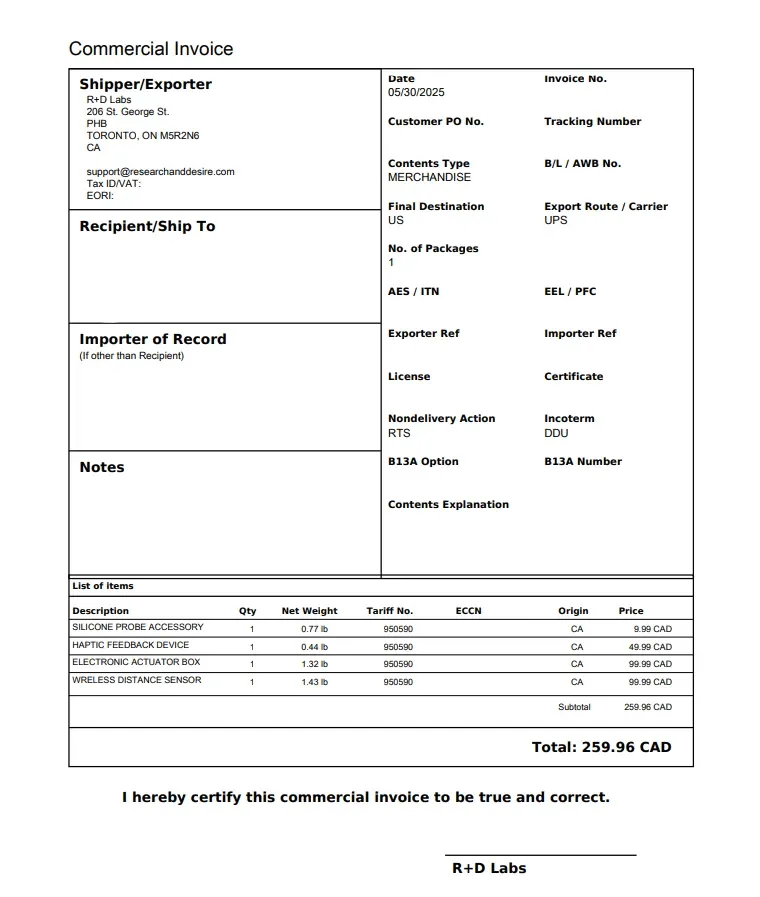

## Votre confidentialité est notre priorité

Nous comprenons que la confidentialité est importante pour vous. C'est pourquoi chaque commande est expédiée dans un emballage neutre et non marqué, sans logo, nom de produit ou information d'identification à l'extérieur. Les étiquettes d'expédition décrivent simplement le contenu comme des « composants électroniques ».

<Frame caption="Emballage neutre sans marque d'identification">
  
</Frame>

## Exemples d'étiquettes d'expédition

Vous voulez voir exactement ce qui arrive à votre porte ? Voici des exemples d’étiquettes d’expédition que nous utilisons :

<Frame caption="Exemple d'étiquette d'expédition montrant une description discrète du produit">
  
</Frame>

<Frame caption="Exemple d'étiquette supplémentaire">
  
</Frame>

<Tip>
  Si vous avez des problèmes spécifiques en matière de confidentialité ou des demandes spéciales concernant votre envoi, contactez notre équipe d'assistance avant de passer votre commande.
</Tip>
