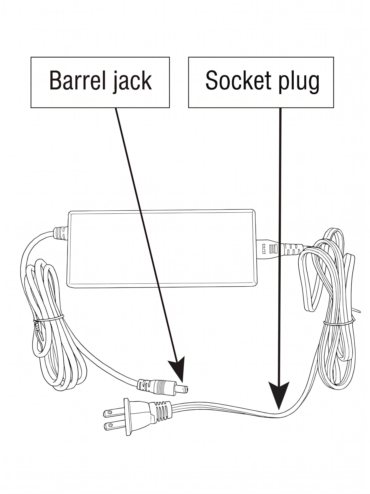
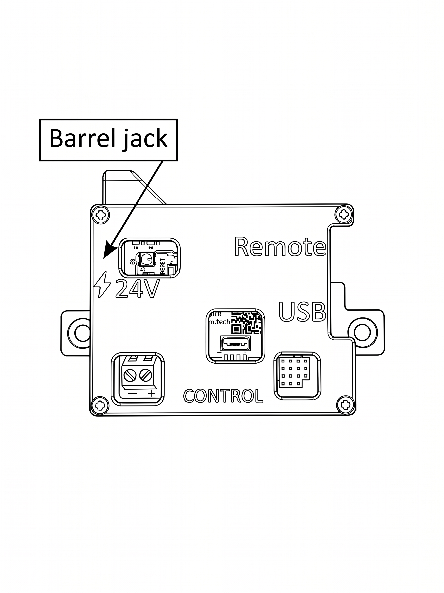
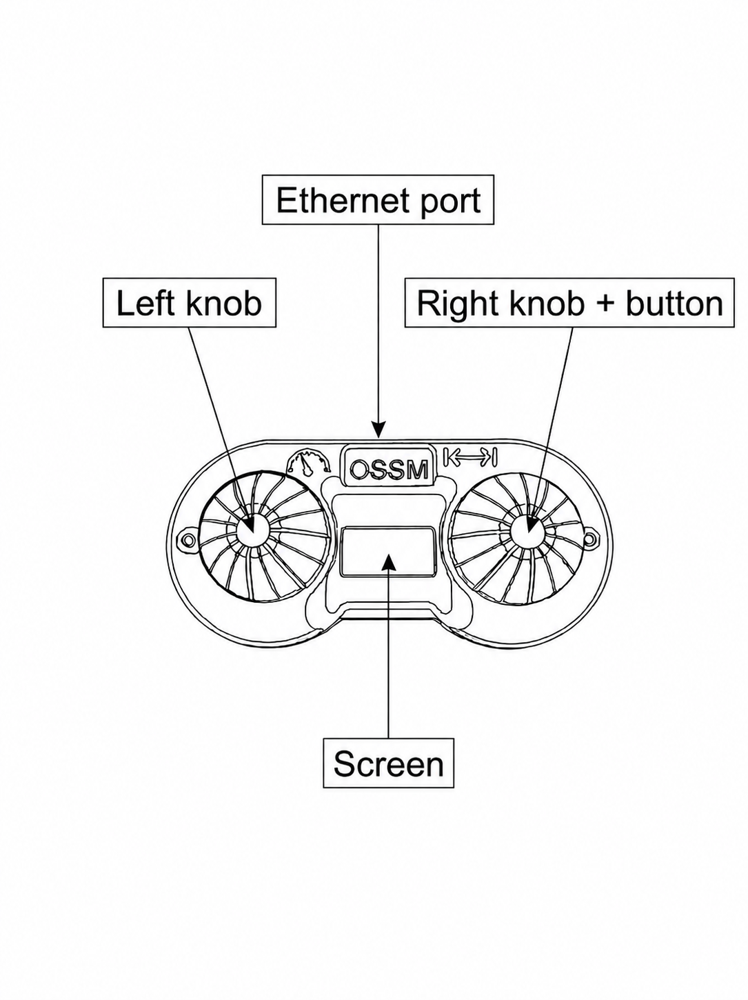
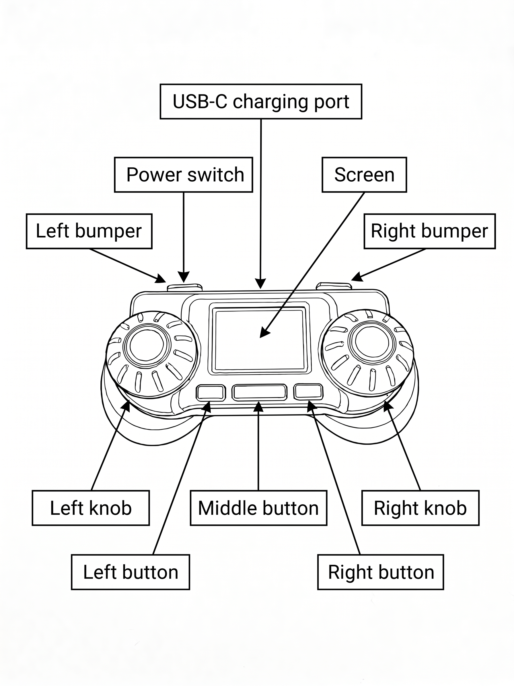
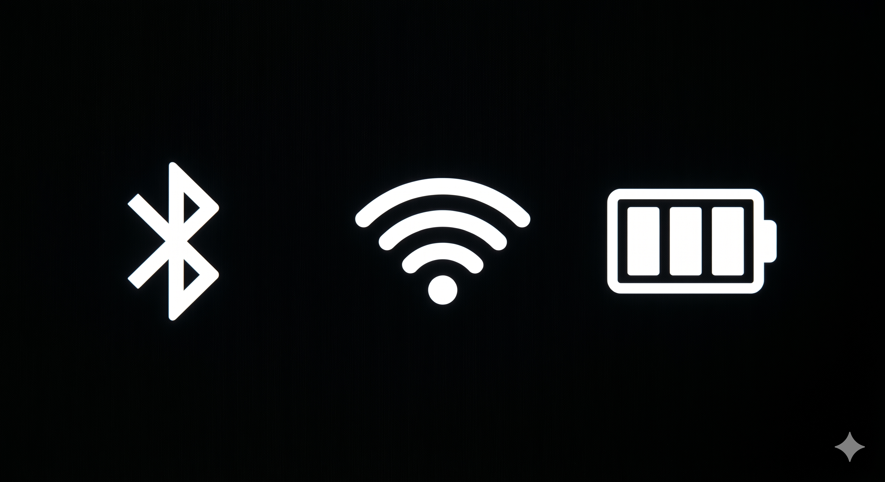
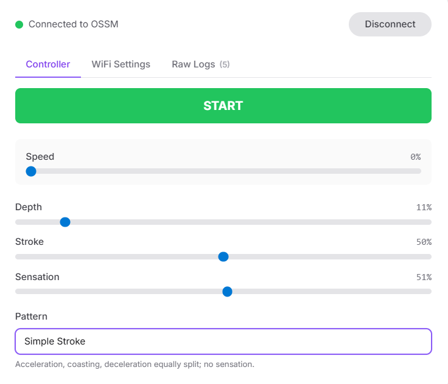
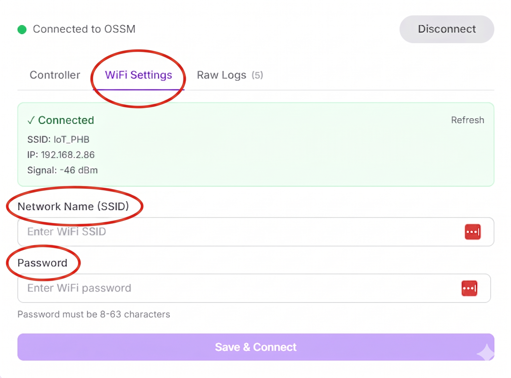

# How to Use

So you've built your OSSM and you're wondering how to put it to good use! Let's dive into this below.

## Connecting Your Device to Power

The OSSM comes with bespoke a 24V 4A DC power supply - this is what will power your machine during play.

Here's how to connect your OSSM to power:

1. Plug the socket plug of the power supply cord into a wall socket

2. Plug the barrel jack end of the power supply into the barrel jack port on your OSSM board

1. Check that the board's LED lights up, and let the device home

!!! success "Your OSSM is receiving power!"

!!! info "Homing is the process by which your OSSM gauges the distance between both end points of the linear rail. To home, the device slowly moves the rail back and forth for a short period of time."

!!! warning "We caution against using third party power supplies as their use may short the OSSM board, thus rendering the OSSM unusable, or provide insufficient operating power."

## Controlling Your OSSM

You can control your OSSM using one of three different remote types:

  1. Wired Remote
  2. Wireless Remote (RADR)
  3. Web Controller

Please note that the OSSM will home when:

1. You connect your OSSM to power
2. You select Simple Penetration or Stroke Engine modes

### Wired Remote

To connect your Wired Remote to the OSSM, first connect the Remote to your OSSM board via Ethernet cable. Then, connect your OSSM to a power source. The Remote screen will flash the R+D logo and present you with an on-screen menu.

The Wired Remote has two knobs - the right knob scrolls the menu and when pressed acts as a selection button. During play (Simple Penetration and Stroke Engine modes), the right knob adjusts stroke length while the left knob adjusts stroke speed. You can press and hold the right knob button during play to stop the machine and return to the Remote's main menu.
  

When not in Simple Penetration or Stroke Engine mode, the right knob button acts as a back button to return you to the main menu.

When in Stroke Engine mode, you double-click the right knob to access pattern selection.

### Wireless Remote

Let's start with some orientation. In comparison to the Wired Remote, the Wireless Remote has more buttons (for fun physical interactivity!) In this doc we'll be directing you to press certain buttons. Take a second to review the photo below to orient yourself with the device's physical controls and how we refer to them.
  

The Wireless Remote connects to your OSSM via Bluetooth. To connect your Wireless Remote to your OSSM, first connect your machine to power and allow it to home. Then, flick the Wireless Remote's power switch. This purple switch can be located to the top left of the Remote screen.

The Remote will detect your OSSM and it will pop up on your Remote screen as a selection option under the name "OSSM". Use the rightmost button to select your machine. The Remote will then connect to your OSSM and proceed to the Simple Stroke screen.

Here you can use the right knob to adjust depth (stroke length) and the left to adjust speed. You can press the middle button to pause the device instantaneously during play.

The right button acts as a selection button, while the left button acts as a back button.

To explore play patterns, click the rightmost button and select whichever pattern suits your fancy. As with Simple Stroke, you can adjust your Speed, Depth, Sensation, and Stroke settings during play. To alternate between Depth, Sensation, and Stroke selections use the left and right bumpers.

!!! info "Sensation affects how Patterns function. When you hover over a Pattern option, a small blurb will appear below that Pattern text that explains how Sensation adjustments affect the pattern's activity."

#### Status Indicators

The Wireless Remote has a Bluetooth connectivity indicator, a WiFi connectivity indicator, and a battery life indicator. You can find them displayed at the top centre of the device screen.

  

!!! failure "If you are unable to connect your Wireless Remote to your OSSM, see our troubleshooting guide here."
!!! failure "If you are unable to connect your Wireless Remote to WiFi, see our troubleshooting guide here."

### Web Controller

The Web Controller allows you to control your OSSM without a physical remote. This remote method requires that your OSSM is connected to WiFi. For instructions on connecting your OSSM to WiFi using the Web Controller, [click this link.](#wifi-setup-option-#1) The interface for the Web Controller looks like this:

  

### Stroke Engine, Patterns, & Sensation

Patterns provide you with a more exciting, spontaneous way to play with your OSSM. Each pattern has unique, pre-set motion parameters that govern how the OSSM interacts with you during use.

- Wired Remote accesses patterns through the "Stroke Engine" selection

- Wireless Remote accesses patterns through the "Patterns" selection

- Web Controller accesses patterns through the "Pattern" dropdown

Below is a list of the patterns that come with the device and a description of what they do:

!!! info "The "X" factor of each pattern is determined by your Sensation settings. Sensation settings can be adjusted via the Wireless Remote and the Web Controller, but cannot be adjusted via the Wired Remote."

1. Simple Stroke - Moves in and out smoothly according to your speed and depth settings. Sensation has no effect.
2. Teasing or Pounding - The machine either thrusts in very slowly and out quickly, or in very quickly and out slowly, as determined by Sensation.
3. Robo Stroke - Adjusts how quickly the device accelerates. Sensation determines acceleration speed.
4. Half'n'Half - Every second stroke is half your selected depth. Sensation affects whether the in our out movement is the faster movement.
5. Deeper - Starts with shallow thrusts and gradually increases to full length thrusts. Sensation affects how short or long the device takes to reach max thrust depth.
6. Stop'n'Go -A series of strokes with intermittent pauses. Sensation controls the length of the pause.
7. Insist - Tiny rapid pulses. Sensation affects whether the feeling of stroke thrust comes from the base or tip of the rail.

## Connecting Your Device to WiFi

Connecting your OSSM to WiFi enables it to receive firmware updates as they are released. This ensures your device is always up to date!

!!! warning "The OSSM is compatible only with a 2.4GHz network."

### WiFi Setup Option #1

1. Connect your OSSM to power and let it home
2. Navigate to the [Web Controller URL](https://docs.researchanddesire.com/ossm/tools/web-controller)
3. Click "Connect" and select your OSSM, then click "Pair"
    
4. Once paired, click on the "WiFi Settings" tab at the top of the Web Controller interface
    
5. Enter your WiFi network's name and password
6. Click "Save & Connect"

!!! success "Yay! You're ready to play."

### WiFi Setup Option #2 (Wireless Remote)

- Connect your OSSM to power and let it home
- Turn on your Wireless Remote and select "Wifi Settings" on your device's menu
- Using your phone camera, scan the QR code that appears on the device screen
- On your phone or computer, connect to the WiFi network named "OSSM Setup"
- Select your WiFi network, enter your password, and save

!!! success "Yay! You're ready to play."
