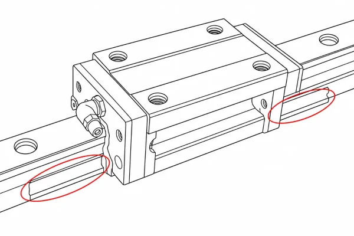

## Cleaning your OSSM

To wipe down any dirty areas we recommend using a microfiber or other gentle cloth dipped in a solution of mild dishsoap and warm water. This will help to remove lube and other residue that may accumulate on the machine during play.

!!! warning "Make sure to unplug your OSSM from power before cleaning the machine."

## Greasing the linear rail

Our linear rails come pre-greased, but you may notice a build-up of debris in the rail's inner channel over time. This can make the movement of the rail rail less smooth. Follow the steps below to re-grease your linear rail:

!!! info "Tools you'll need: a microfiber cloth and any food-grade grease."

1. Manually extend the rail
2. Place a small dollop of grease on the rail using a clean finger
3. Using a clean hand, run the grease through the inner channel of the rail

4. Clean up any excess grease with a microfiber cloth

!!! success "Your rail is now greased!"

!!! warning "Make sure to unplug your OSSM from power before greasing the linear rail."
