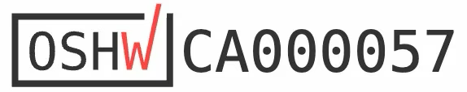

# Open Source Info

## Why open source?

The ethos of open source hardware and software is very important to us at Research and Desire. The Open Source Sex Machine is open source because we believe that:

1. The open source contribution structure increases transparency around the product's design and change history
2. Dovetailing with this, the machine's repairaibility is improved
3. Contributions are egalitarian. When one OSSM gets better, all OSSMs get better
4. Together we generate a lively social network of OSSM contributers and enjoyers

# OSHWA & CERN OHL

We are proud to say that the OSSM is fully open source and under the Conseil Européen pour la Recherche Nucléaire's Open Hardware License (CERN OHL). The OSSM is also registered with The Open Source Hardware Association (OSHWA).

Please find the OSSM's OSHWA registration number below:

Please find the OSSM's CERN OHL license category below:

CERN-OHL-S-v2

!!! info "If you'd like to read more about OSHWA or CERN OHL, check out the [OSHWA](https://oshwa.org/) and [CERN OHL](https://cern-ohl.web.cern.ch/) websites."

## What this means for contributors

When you contribute to the [OSSM GitHub repository](https://github.com/KinkyMakers/OSSM-hardware) your contributions fall under the same highly reciprocal CERN-OHL-S-v2 license.

!!! info "You can access the terms of this license [here](https://gitlab.com/ohwr/project/cernohl/-/wikis/uploads/819d71bea3458f71fba6cf4fb0f2de6b/cern_ohl_s_v2.txt)."

## Who can contribute?

Open source means contributions can come from anyone, anywhere. Before contributing, we advise that you do the following:

1. Take time to thoroughly read the [CERN-OHL-S-v2 license terms](https://gitlab.com/ohwr/project/cernohl/-/wikis/uploads/819d71bea3458f71fba6cf4fb0f2de6b/cern_ohl_s_v2.txt) to understand how the license functions
2. Review our [Pre-play Safety Checklist](how-to-use.md)

!!! success "You're ready to contribute!"
